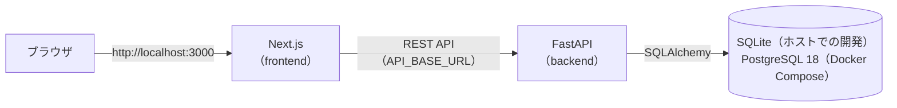

# AI Support Desk

社内ヘルプデスク担当者向けの問い合わせ管理 Web アプリです。
人間が要件定義・設計承認・レビュー・受入判断を行い、ChatGPT と Claude Code を工程ごとに使い分けた AI 支援開発で、段階的に開発しています。

## 構成

| ディレクトリ | 内容 |
|---|---|
| [`frontend/`](frontend/) | Next.js 16（App Router）による画面。FastAPI をサーバー側から呼び出す。詳細は [frontend/README.md](frontend/README.md) |
| [`backend/`](backend/) | Python / FastAPI による REST API（Demo 2 で構築中）。詳細は [backend/README.md](backend/README.md) |
| [`docs/`](docs/) | 承認済みの設計・技術判断・検証結果の記録。方針と目次は [docs/README.md](docs/README.md) |

## Demo の段階

| Demo | 内容 | 状態 |
|---|---|---|
| Demo 1 | Next.js の UI と、インメモリのモックデータによる問い合わせ管理 | 完了（タグ `demo-1`） |
| Demo 2 | FastAPI + SQLAlchemy + SQLite による REST API とデータ永続化 | 完了（Step 6B：Docker Compose での PostgreSQL 化まで） |
| Demo 3 | AI 問い合わせ支援 Agent（FAQ 検索 Tool・問い合わせ起票 Tool・チャット UI） | 開発中（Step 1：FAQ データと検索 API まで完了） |

## 構成図



ブラウザは Next.js とだけ通信し、FastAPI は Next.js のサーバー側から呼び出します（ブラウザから FastAPI へは直接通信しません）。DB は `DATABASE_URL` で切り替えます（ホストでの開発は SQLite、Docker Compose は PostgreSQL）。

## ローカルでの起動方法

Python 3.11 と Node.js 20.9 以上が必要です。ターミナルを 2 つ使います。

```bash
# 1. backend（http://localhost:8000）
cd backend
python3.11 -m venv .venv && source .venv/bin/activate
pip install -r requirements-dev.txt
alembic upgrade head          # DB（backend/data/app.db）を作成
python -m app.db.seed         # 初期データ 8 件（空のときだけ投入）
uvicorn app.main:app --port 8000

# 2. frontend（http://localhost:3000）
cd frontend
npm install
npm run dev                   # 本番ビルドで確認する場合は npm run build && npm start
```

ブラウザで http://localhost:3000 を開きます。frontend が接続する API の URL は `frontend/.env.local` の `API_BASE_URL` で変更できます（既定値 `http://localhost:8000`、[frontend/.env.example](frontend/.env.example) 参照）。

DB を初期状態に戻す場合は `backend/` で `alembic downgrade base && alembic upgrade head && python -m app.db.seed` を実行します。

## Docker Compose での起動

本番に近い構成（frontend・backend・PostgreSQL をコンテナで実行）で確認する場合に使います。開発時は上記のホストでの起動を使ってください。Docker Desktop（Docker Compose v2）が必要です。

```bash
cp .env.example .env                                      # 初回のみ。POSTGRES_PASSWORD を設定（openssl rand -hex 24 など）
docker compose up -d --build                              # db → migrate → backend → frontend の順に起動
docker compose run --rm backend python -m app.db.seed     # 初期データ 8 件（手動。空のときだけ投入）
```

ブラウザで http://localhost:3000 を開きます。

| サービス | 内容 | ホストへの公開 |
|---|---|---|
| `db` | PostgreSQL 18（`postgres:18-alpine`）。データは volume `ai-support-desk_pgdata` | **なし**（確認は `docker compose exec db psql`） |
| `migrate` | `alembic upgrade head` を実行して終了する | なし |
| `backend` | FastAPI。frontend からは `http://backend:8000` で接続 | **なし**（ブラウザから直接アクセスしない） |
| `frontend` | Next.js（standalone） | `3000` |

- 接続情報（`POSTGRES_DB` / `POSTGRES_USER` / `POSTGRES_PASSWORD`）はリポジトリ直下の `.env`（Git 管理対象外）に置き、`compose.yaml` で `DATABASE_URL` を組み立てます。`docker compose config` の出力はパスワードを含むため共有しないでください。
- `docker compose down` ではデータは残り、`docker compose down -v` で volume ごと削除されます。
- PostgreSQL でテストを実行する場合: `docker compose --profile test run --rm backend-test`（使い捨ての `db-test` を使用。開発用の `db` には触れません）
- 設計の詳細は [docs/demo2/step6a-docker.md](docs/demo2/step6a-docker.md)・[docs/demo2/step6b-postgresql.md](docs/demo2/step6b-postgresql.md) を参照してください。
