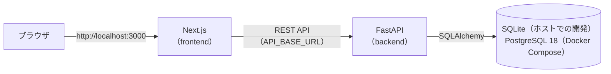

# AI Support Desk

**Next.js / FastAPI / PostgreSQL で作った社内ヘルプデスク向けの問い合わせ管理システムに、Tool を利用する AI Agent（AIサポート）を追加したデモです。**

利用者がチャットで困りごとを入力すると、Agent が **FAQ 検索 Tool** で回答し、FAQ で解決しない場合や登録を頼まれた場合は **問い合わせ起票案 Tool** で起票案を作ります。起票案は自動登録せず、人が既存の登録画面で確認・修正してから登録します（Human-in-the-loop）。

```
Browser（/chat）
  ↓  Server Action（ブラウザの通信先は Next.js のみ）
Next.js（frontend）
  ↓  HTTP（Next.js のサーバー側から呼び出し）
FastAPI（backend）  POST /agent/chat
  ↓  AGENT_PROVIDER で切り替え
Agent ── rule（既定）: RuleBasedAgent
      └─ openai      : FallbackAgent（LLMAgent → OpenAI Responses API。障害時は RuleBasedAgent）
  ↓  許可リストの Tool だけを呼ぶ
  ├─ search_faqs    … FAQ 検索 Tool
  └─ draft_inquiry  … 問い合わせ起票案 Tool（DB には書き込まない）
  ↓
PostgreSQL（faqs / inquiries）

起票案 → 人が既存の登録画面（/inquiries/new）で確認・修正 → 既存の POST /inquiries で登録
```

- **面談用デモ手順・想定 Q&A**: [docs/demo3/demo-script.md](docs/demo3/demo-script.md)
- **設計記録（Step ごと）**: [docs/README.md](docs/README.md)
- 人間が要件定義・設計承認・レビュー・受入判断を行い、ChatGPT と Claude Code を工程ごとに使い分けた AI 支援開発で、段階的に開発しています（[開発プロセス](#開発プロセスai-駆動開発)）。

## AI Agent について（現在の実装）

| 項目 | 内容 |
|---|---|
| Agent | 既定は **RuleBasedAgent**（ルールベース）。どの Tool を呼ぶかを決まった手順で判断し、Tool の結果から回答を組み立てます。外部 LLM API を使わず、API キーなし・追加費用なしでデモ全体が動きます |
| LLM Agent | `AGENT_PROVIDER=openai` で LLM Agent に切り替えられます（下記） |
| Tool | `search_faqs`（FAQ をキーワード + 部分一致のスコアで検索）、`draft_inquiry`（メッセージから起票案のタイトル・カテゴリ・内容を作成。登録依頼の言い回しを判定） |
| 応答 | `POST /agent/chat` → `message`・`action`（`FAQ_ANSWER` / `INQUIRY_DRAFTED` / `INQUIRY_SUGGESTED`）・`matchedFaqs`・`toolCalls`（呼び出した Tool）・`inquiryDraft` |
| 安全性 | Agent は問い合わせを DB に登録しません。登録は人の操作 → 既存の `POST /inquiries` のみ（テストで INSERT が発生しないことを確認） |
| 開発の順序 | 先に RuleBasedAgent で Tool の契約（名前・説明・引数の JSON Schema）と業務フローを固め、その上に LLM Agent を追加しました。Agent は共通インターフェース（`respond(session, message)`）の実装です |

### LLM Agent（Demo 3 Step 5）

| 項目 | 内容 |
|---|---|
| Provider の切り替え | `AGENT_PROVIDER=rule`（既定）/ `openai`。API・画面・Tool は同じです |
| Provider の分離 | LLMAgent は `LLMClient` Protocol にだけ依存します。OpenAI 固有の処理は Adapter（`OpenAIResponsesClient`。OpenAI Responses API、`store=False`）に閉じ込め、他のプロバイダは Adapter の追加で対応できます |
| Tool calling | LLM が呼べるのは許可リストの `search_faqs`・`draft_inquiry` だけ（strict な JSON Schema・引数の検証・呼び出し回数とループ回数・時間の上限あり）。登録・更新の Tool はありません。FAQ・起票案・`action` は LLM の文章ではなく Tool の実行結果から作ります |
| Human-in-the-loop | LLM Agent でも DB には書き込まず、起票案までです。登録は人が既存の画面から行います |
| フォールバック | LLM の障害（タイムアウト・レート制限・認証エラー・不正な応答など）では RuleBasedAgent で応答します（`AGENT_FALLBACK_TO_RULE=true` が既定） |
| API キー | `OPENAI_API_KEY` は backend の環境変数だけに渡します（frontend には渡しません。Git・イメージにも含めません） |
| 検証の範囲 | **Adapter と Mock / Fake によるテストまで実装済みです。実 OpenAI API への接続は任意で、未実施です。** 面談デモは rule provider で行い、外部 LLM API なしで動きます |

設定の一覧・設計の詳細は [docs/demo3/step5-llm-agent.md](docs/demo3/step5-llm-agent.md) を参照してください。

## 構成

| ディレクトリ | 内容 |
|---|---|
| [`frontend/`](frontend/) | Next.js 16（App Router）による画面。FastAPI をサーバー側から呼び出す。詳細は [frontend/README.md](frontend/README.md) |
| [`backend/`](backend/) | Python / FastAPI による REST API と AI Agent（`agents/`・`tools/`）。詳細は [backend/README.md](backend/README.md) |
| [`docs/`](docs/) | 承認済みの設計・技術判断・検証結果の記録。方針と目次は [docs/README.md](docs/README.md) |

## Demo の段階

| Demo | 内容 | 状態 |
|---|---|---|
| Demo 1 | Next.js の UI と、インメモリのモックデータによる問い合わせ管理 | 完了（タグ `demo-1`） |
| Demo 2 | FastAPI + SQLAlchemy + SQLite による REST API とデータ永続化 | 完了（Step 6B：Docker Compose での PostgreSQL 化まで） |
| Demo 3 | AI 問い合わせ支援 Agent（FAQ 検索 Tool・問い合わせ起票 Tool・チャット UI・LLM Agent） | Step 1〜6 完了（Step 5 の LLM Agent は Mock / Fake テストまで。実 API 接続は任意） |

## 構成図



ブラウザは Next.js とだけ通信し、FastAPI は Next.js のサーバー側から呼び出します（ブラウザから FastAPI へは直接通信しません）。DB は `DATABASE_URL` で切り替えます（ホストでの開発は SQLite、Docker Compose は PostgreSQL）。

## ローカルでの起動方法

Python 3.11 と Node.js 20.9 以上が必要です。ターミナルを 2 つ使います。

```bash
# 1. backend（http://localhost:8000）
cd backend
python3.11 -m venv .venv && source .venv/bin/activate
pip install -r requirements-dev.txt
alembic upgrade head          # DB（backend/data/app.db）を作成
python -m app.db.seed         # 初期データ（問い合わせ 8 件・FAQ 10 件。空のときだけ投入）
uvicorn app.main:app --port 8000

# 2. frontend（http://localhost:3000）
cd frontend
npm install
npm run dev                   # 本番ビルドで確認する場合は npm run build && npm start
```

ブラウザで http://localhost:3000 を開きます。frontend が接続する API の URL は `frontend/.env.local` の `API_BASE_URL` で変更できます（既定値 `http://localhost:8000`、[frontend/.env.example](frontend/.env.example) 参照）。

DB を初期状態に戻す場合は `backend/` で `alembic downgrade base && alembic upgrade head && python -m app.db.seed` を実行します。

## Docker Compose での起動

本番に近い構成（frontend・backend・PostgreSQL をコンテナで実行）で確認する場合に使います。開発時は上記のホストでの起動を使ってください。Docker Desktop（Docker Compose v2）が必要です。

```bash
cp .env.example .env                                      # 初回のみ。POSTGRES_PASSWORD を設定（openssl rand -hex 24 など）
docker compose up -d --build                              # db → migrate → backend → frontend の順に起動
docker compose run --rm backend python -m app.db.seed     # 初期データ（問い合わせ 8 件・FAQ 10 件。手動。空のときだけ投入）
```

ブラウザで http://localhost:3000 を開きます（AIサポートは http://localhost:3000/chat）。`.env` に Agent の設定がなければ RuleBasedAgent で動きます（API キー不要）。

| サービス | 内容 | ホストへの公開 |
|---|---|---|
| `db` | PostgreSQL 18（`postgres:18-alpine`）。データは volume `ai-support-desk_pgdata` | **なし**（確認は `docker compose exec db psql`） |
| `migrate` | `alembic upgrade head` を実行して終了する | なし |
| `backend` | FastAPI。frontend からは `http://backend:8000` で接続 | **なし**（ブラウザから直接アクセスしない） |
| `frontend` | Next.js（standalone） | `3000` |

- 接続情報（`POSTGRES_DB` / `POSTGRES_USER` / `POSTGRES_PASSWORD`）はリポジトリ直下の `.env`（Git 管理対象外）に置き、`compose.yaml` で `DATABASE_URL` を組み立てます。`docker compose config` の出力はパスワード・API キーを含むため共有しないでください。
- LLM Agent を使う場合（任意・OpenAI API の利用料金が発生します）は、`.env` に `AGENT_PROVIDER=openai`・`OPENAI_API_KEY`・`OPENAI_MODEL` を設定します。これらは backend コンテナにだけ渡されます。
- `docker compose down` ではデータは残り、`docker compose down -v` で volume ごと削除されます。
- PostgreSQL でテストを実行する場合: `docker compose --profile test run --rm backend-test`（使い捨ての `db-test` を使用。開発用の `db` には触れません）
- 設計の詳細は [docs/demo2/step6a-docker.md](docs/demo2/step6a-docker.md)・[docs/demo2/step6b-postgresql.md](docs/demo2/step6b-postgresql.md) を参照してください。

## 開発プロセス（AI 駆動開発）

各 Step を次の流れで進めました。人間が設計・レビュー・受入判断を担当し、Claude Code（coding agent）を実装作業に利用しています。

```
要件整理（人間 + ChatGPT）
  ↓
設計案の作成（Claude Code が既存コード・同梱ドキュメントを調査して提示）
  ↓
人間による設計確認・判断（判断事項を選択して承認）
  ↓
Claude Code へ実装指示
  ↓
AI による実装（Claude Code）
  ↓
自動テスト・検証（pytest を SQLite / PostgreSQL の両方で実行、tsc・lint・build、Docker Compose + ヘッドレス Chrome による E2E）
  ↓
不具合の原因調査・修正 → 回帰テスト
  ↓
人間による差分・結果確認（受入判断）
  ↓
Git commit（人間が手動で実施）
```

- 各 Step の設計判断・検証結果・見つかった問題と対応は [docs/](docs/README.md) に記録しています（会話ログではなく、人間が承認した内容）。
- 品質の担保: backend は pytest 378 件（SQLite / PostgreSQL 両方。LLM の経路は Fake / Mock で検証し、実 API は呼ばない）、Alembic のモデル差分チェック、frontend は型チェック・lint・本番ビルド、Docker Compose 上でのブラウザ E2E（Human-in-the-loop の登録で DB 件数が人の操作時のみ増えることを含む）。
