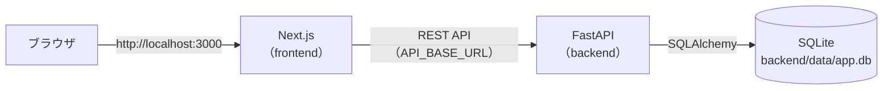

# AI Support Desk

社内ヘルプデスク担当者向けの問い合わせ管理 Web アプリです。
人間が要件定義・設計承認・レビュー・受入判断を行い、ChatGPT と Claude Code を工程ごとに使い分けた AI 支援開発で、段階的に開発しています。

## 構成

| ディレクトリ | 内容 |
|---|---|
| [`frontend/`](frontend/) | Next.js 16（App Router）による画面。FastAPI をサーバー側から呼び出す。詳細は [frontend/README.md](frontend/README.md) |
| [`backend/`](backend/) | Python / FastAPI による REST API（Demo 2 で構築中）。詳細は [backend/README.md](backend/README.md) |
| [`docs/`](docs/) | 承認済みの設計・技術判断・検証結果の記録。方針と目次は [docs/README.md](docs/README.md) |

## Demo の段階

| Demo | 内容 | 状態 |
|---|---|---|
| Demo 1 | Next.js の UI と、インメモリのモックデータによる問い合わせ管理 | 完了（タグ `demo-1`） |
| Demo 2 | FastAPI + SQLAlchemy + SQLite による REST API とデータ永続化 | 開発中（Step 5：frontend と FastAPI の接続まで完了） |

## 構成図



ブラウザは Next.js とだけ通信し、FastAPI は Next.js のサーバー側から呼び出します（ブラウザから FastAPI へは直接通信しません）。

## ローカルでの起動方法

Python 3.11 と Node.js 20.9 以上が必要です。ターミナルを 2 つ使います。

```bash
# 1. backend（http://localhost:8000）
cd backend
python3.11 -m venv .venv && source .venv/bin/activate
pip install -r requirements-dev.txt
alembic upgrade head          # DB（backend/data/app.db）を作成
python -m app.db.seed         # 初期データ 8 件（空のときだけ投入）
uvicorn app.main:app --port 8000

# 2. frontend（http://localhost:3000）
cd frontend
npm install
npm run dev                   # 本番ビルドで確認する場合は npm run build && npm start
```

ブラウザで http://localhost:3000 を開きます。frontend が接続する API の URL は `frontend/.env.local` の `API_BASE_URL` で変更できます（既定値 `http://localhost:8000`、[frontend/.env.example](frontend/.env.example) 参照）。

DB を初期状態に戻す場合は `backend/` で `alembic downgrade base && alembic upgrade head && python -m app.db.seed` を実行します。
