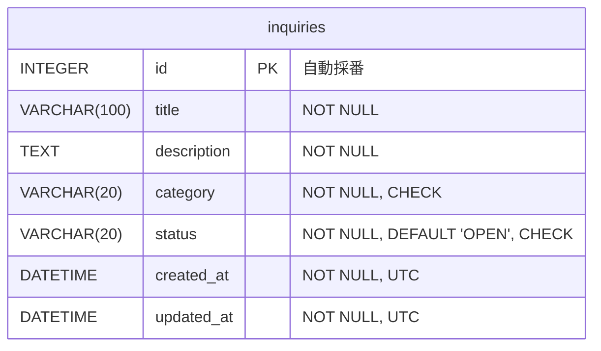

# Demo 2 Step 2 — SQLAlchemy + SQLite + Alembic による DB 層

| 項目 | 内容 |
|---|---|
| 状態 | 完了 |
| 実施日 | 2026-10-06 |
| 前提 | [Demo 2 Step 1](step1-backend-foundation.md)（FastAPI の土台・`/health`・pytest + httpx2）完了 |

## 1. 目的とスコープ

問い合わせデータを SQLite に永続化するための DB 基盤を構築します。あわせて、将来 `DATABASE_URL` を変えるだけで Azure Database for PostgreSQL へ移行できる構成にします。

**やること**

- SQLAlchemy 2.x（2.x スタイル）の導入、Engine と Session の基盤
- SQLite 固有の処理を 1 つのモジュールに隔離
- `Inquiry` ORM モデル、category / status の Enum、UTC の日時型
- Alembic の導入と初期 migration（スキーマは migration だけで作成し、`create_all()` は使わない）
- Demo 1 の 8 件を使った冪等な seed
- `GET /health/ready`（DB の readiness）
- DB 層の pytest

**やらないこと（後続 Step で実施）**

- Inquiry API（`GET /inquiries`、`POST /inquiries`、`PATCH /inquiries/{id}/status` など）
- Pydantic のリクエスト / レスポンススキーマ
- frontend との接続、CORS 設定
- PostgreSQL への実際の接続

## 2. ディレクトリ構成

```
backend/
├── alembic.ini
├── alembic/
│   ├── env.py
│   ├── script.py.mako
│   └── versions/
│       └── 20261006_d39d3345e879_create_inquiries_table.py
├── app/
│   ├── config.py            # 変更：backend/ 基準の絶対パスで解決
│   ├── db/
│   │   ├── base.py
│   │   ├── session.py
│   │   ├── sqlite.py
│   │   ├── types.py
│   │   ├── seed.py
│   │   └── seed_data.py
│   ├── models/
│   │   ├── __init__.py
│   │   └── inquiry.py
│   └── routers/
│       └── health.py        # 変更：/health/ready を追加
├── data/
│   ├── .gitkeep             # 管理対象
│   └── app.db               # 管理対象外
└── tests/
    ├── conftest.py
    ├── test_config.py
    ├── test_health.py
    └── db/
        ├── test_migrations.py
        ├── test_inquiry_model.py
        └── test_seed.py
```

| ファイル | 役割 |
|---|---|
| `app/db/base.py` | `DeclarativeBase` と、制約名の命名規則を設定した `MetaData` |
| `app/db/session.py` | `create_db_engine()`、`create_session_factory()`、`SessionLocal`、`get_db()` |
| `app/db/sqlite.py` | SQLite 固有の設定（`check_same_thread`、`PRAGMA foreign_keys`）。**SQLite 固有のコードはここだけ** |
| `app/db/types.py` | `UTCDateTime`（TypeDecorator）と `utc_now()` |
| `app/db/seed.py` | seed コマンド（`python -m app.db.seed`） |
| `app/db/seed_data.py` | Demo 1 の 8 件（id は持たない） |
| `app/models/inquiry.py` | `Inquiry`、`InquiryCategory`、`InquiryStatus` |
| `app/models/__init__.py` | 全モデルを import し、`Base.metadata` に登録する（Alembic が参照） |
| `alembic/env.py` | 接続 URL を `settings` から取得、SQLite のときだけ batch モード |
| `tests/conftest.py` | 一時 SQLite に Alembic migration を適用する共通フィクスチャ |

依存の向きは `models → db → config` です。`alembic/env.py` は `config` と `models` を参照します。

## 3. 技術判断

| 判断 | 理由 | 検討した代替案 |
|---|---|---|
| SQLAlchemy 2.1 を 2.x スタイル（`Mapped` / `mapped_column` / `select()`）で使う | 型ヒントで列定義が読みやすく、1.x の旧 API は将来廃止されるため | 1.x スタイル |
| 同期 API（`Session`）を使う | FastAPI は `def` のエンドポイントをスレッドプールで実行するので、この規模では十分。設計とテストが簡単 | 非同期（`AsyncSession` + aiosqlite / asyncpg） |
| SQLite 固有の処理は `app/db/sqlite.py` に隔離し、URL のバックエンド名で分岐する | PostgreSQL に移行するとき、コードを変えずに済む | 設定やモデルの各所で SQLite 用に分岐する |
| スキーマは Alembic migration だけで作る（`create_all()` は使わない） | 本番環境・開発環境・テストで同じ手順でスキーマを作り、変更履歴を残すため | `create_all()`（変更履歴が残らず、既存の DB を変更できない） |
| テスト用の DB も migration で作る | テストのたびに migration そのものも検証される | テストだけ `create_all()` を使う |
| category / status は VARCHAR(20) ＋ 名前付き CHECK 制約。Python 側は `StrEnum`（名前 ＝ 値） | SQLite と PostgreSQL で同じ DDL になり、どちらでも DB が不正な値を拒否する。値は DB・API・frontend で共通 | PostgreSQL のネイティブ ENUM（値の追加に `ALTER TYPE` が必要で、autogenerate が変更を検出できない。SQLite にはない） |
| 制約名に命名規則を設定（`pk_` / `ck_` / `ix_` など） | 制約名が DB によらず決まり、後の migration で制約を名前で変更できる。SQLite の batch モードにも必要 | DB による自動命名 |
| 日時は UTC のタイムゾーン付き datetime だけを扱い、`UTCDateTime` で DB 間の差を吸収する | SQLite はタイムゾーンを保持できず、PostgreSQL（timestamptz）は接続の設定で返す値のタイムゾーンが変わる | naive な UTC で統一（PostgreSQL で取り違えやすい） |
| `created_at` / `updated_at` の既定値は Python 側（`default` / `onupdate`） | どちらの DB でも同じ精度・同じ値になり、テストしやすい | `server_default=func.now()`（SQLite は秒精度、PostgreSQL はトランザクション開始時刻で、挙動が揃わない） |
| seed は「テーブルが空のときだけ投入」し、id は指定しない（DB が採番） | PostgreSQL で id を明示して INSERT するとシーケンスが進まず、次の登録で id が衝突する。画面での変更も上書きしない | 1 件ずつ id で存在確認して投入（PostgreSQL でシーケンスの調整が必要） |
| `/health`（liveness）と `/health/ready`（readiness）を分ける | liveness が DB に依存すると、DB が一時的に止まっただけでプロセスが再起動されてしまう | `/health` で DB も確認する |
| Alembic は実行時の依存（`requirements.txt`）に入れる | 本番環境でも `alembic upgrade head` を実行するため | 開発用の依存に入れる |
| アプリ起動時に migration を自動実行しない | スキーマの変更は人が明示的に実行する運用にするため | 起動時に `upgrade head` を実行する |
| 設定ファイルのパスは `backend/` を基準にした絶対パスで解決する（`BACKEND_DIR`） | uvicorn・pytest・alembic・seed をどこから実行しても、同じ `backend/data/app.db` と `backend/.env` を参照する | 相対パス（起動したディレクトリで参照先が変わる） |
| `data/` は `.gitkeep` で管理し、`*.db` などは除外する | SQLite は親ディレクトリを自動で作らないため。DB ファイル自体は管理しない | 起動時にディレクトリを作成する（SQLite 固有のコードが増える） |

## 4. テーブル定義



| カラム | SQLite | PostgreSQL | 制約・既定値 | 備考 |
|---|---|---|---|---|
| `id` | INTEGER | SERIAL | PK（`pk_inquiries`） | 自動採番 |
| `title` | VARCHAR(100) | VARCHAR(100) | NOT NULL | SQLite は長さを強制しないので、Step 3 の API でも検証する |
| `description` | TEXT | TEXT | NOT NULL | 2000 文字の上限は Step 3 の API で検証する |
| `category` | VARCHAR(20) | VARCHAR(20) | NOT NULL、`ck_inquiries_category` | `ACCOUNT` / `NETWORK` / `SOFTWARE` / `OTHER` |
| `status` | VARCHAR(20) | VARCHAR(20) | NOT NULL、`ck_inquiries_status`、DEFAULT `'OPEN'` | `OPEN` / `IN_PROGRESS` / `CLOSED` |
| `created_at` | DATETIME | TIMESTAMPTZ | NOT NULL | UTC |
| `updated_at` | DATETIME | TIMESTAMPTZ | NOT NULL | UTC、ORM で更新するたびに更新される |

インデックス：`ix_inquiries_created_at`（一覧の並び順）、`ix_inquiries_status`（絞り込み）

### 日時の扱い（`UTCDateTime`）

| 場面 | 処理 |
|---|---|
| 保存時 | naive な datetime は `ValueError` で拒否する。aware な値は UTC に変換する |
| SQLite に保存される値 | SQLAlchemy の SQLite 用 DATETIME は、タイムゾーン部分を含めずに `YYYY-MM-DD HH:MM:SS.ffffff` の文字列で保存する。UTC に変換したあとの値が保存されるので、文字列の並び順は時刻の順になる |
| 読み出し時 | SQLite から返る naive な値には UTC を付ける。PostgreSQL から返る aware な値は UTC に変換する |

`onupdate` は ORM を通した UPDATE でしか働きません。SQL を直接実行して更新する場合は、`updated_at` も自分で設定する必要があります。

## 5. API 仕様：`GET /health/ready`

| 項目 | 内容 |
|---|---|
| メソッド・パス | `GET /health/ready` |
| 確認内容 | `get_db()` で得た Session で `SELECT 1` を実行する |
| 正常時 | `200 OK`、`{"status": "ok"}` |
| DB に接続できないとき | `503 Service Unavailable`、`{"status": "unavailable"}`。例外の詳細や接続先は返さず、サーバーログにだけ出力する |
| 応答の型 | `ReadinessResponse`（`status: Literal["ok", "unavailable"]`）。OpenAPI に 200 と 503 を記載 |
| 確認しない範囲 | migration が適用済みかどうか。SQLite は存在しないファイルに接続すると空の DB を作るため、migration 前でも 200 になる |

`GET /health`（liveness）は Step 1 から変更していません。

## 6. 環境変数

| 変数名 | 既定値 | 説明 |
|---|---|---|
| `DATABASE_URL` | `sqlite:///<backend の絶対パス>/data/app.db` | 起動ディレクトリによらず `backend/data/app.db` を指す |

- 読み込む順番は、環境変数 → `backend/.env` → 既定値です。`.env` のパスも `backend/` を基準に解決します（Step 1 ではカレントディレクトリ基準でした）。
- SQLite の URL を上書きするときは、絶対パスで書きます。相対パスを補正する処理は、SQLite 固有のロジックを config に持ち込まないために入れていません。
- `.env.example` では `DATABASE_URL` をコメントアウトし、SQLite（絶対パス）と Azure PostgreSQL の記入例を載せています。

## 7. seed の仕様

| 項目 | 内容 |
|---|---|
| 実行 | `python -m app.db.seed` |
| データ | Demo 1（`frontend/src/lib/inquiries/mock-data.ts`）の 8 件。`app/db/seed_data.py` に Python の定数として定義 |
| 冪等性 | `inquiries` が空のときだけ 8 件を 1 トランザクションで投入する。1 件でもあれば何もしない |
| id | 指定しない（DB が採番）。新しく作った DB では 1〜8 になる |
| created_at / updated_at | Demo 1 の値（UTC）。updated_at は created_at と同じ値 |
| migration がまだのとき | `MissingTableError`。コマンドは「先に `alembic upgrade head` を実行してください」と表示して終了コード 1 を返す |
| 初期化 | `alembic downgrade base && alembic upgrade head && python -m app.db.seed` |

`mock-data.ts` は frontend を API に接続する Step で使われなくなるので、データを共有するファイル（JSON など）は作っていません。

## 8. 検証結果

確認日：2026-10-06（macOS / Python 3.11.9）

### インストールしたパッケージ

| パッケージ | バージョン | 区分 |
|---|---|---|
| sqlalchemy | 2.1.3 | 実行（新規） |
| alembic | 1.20.0 | 実行（新規） |
| fastapi | 0.142.2 | 実行 |
| uvicorn[standard] | 0.54.0 | 実行 |
| pydantic-settings | 2.15.0 | 実行 |
| pytest | 9.1.1 | 開発 |
| httpx2 | 2.13.1 | 開発 |

新たに入った推移的依存：Mako 1.4.3、MarkupSafe 3.0.4。`pip check` で依存関係に問題がないことを確認しました。

### 実施した確認

| 確認内容 | コマンド | 結果 |
|---|---|---|
| migration の適用 | `alembic upgrade head` | `Running upgrade -> d39d3345e879, create inquiries table` |
| 現在のリビジョン | `alembic current` | `d39d3345e879 (head)` |
| モデルとの差分 | `alembic check` | `No new upgrade operations detected.` |
| スキーマ | `sqlite3 data/app.db ".schema inquiries"` | §4 のとおり。CHECK 制約は各 1 つ |
| PostgreSQL 向けの DDL | `DATABASE_URL=postgresql+psycopg://... alembic upgrade head --sql`（接続はしない） | `SERIAL`、`TIMESTAMP WITH TIME ZONE`、CHECK 制約は各 1 つ |
| downgrade | `alembic downgrade base` | `inquiries` が削除され、`alembic current` は空になる |
| 再 upgrade | `alembic upgrade head` | head に戻る |
| seed（1 回目） | `python -m app.db.seed` | `8 件の問い合わせを投入しました。` |
| seed（2 回目） | `python -m app.db.seed` | `既にデータがあるため seed をスキップしました。` |
| 件数と内容 | `SELECT ... FROM inquiries` | 8 件。id 1〜8、Demo 1 と同じ category・status・created_at（UTC） |
| 別のディレクトリからの実行 | リポジトリのルートや別のディレクトリから `alembic -c backend/alembic.ini current` と seed を実行 | `backend/data/app.db` を参照する（実行したディレクトリに DB は作られない） |
| liveness | `curl -i localhost:8000/health` | `200 {"status":"ok"}` |
| readiness | `curl -i localhost:8000/health/ready` | `200 {"status":"ok"}` |
| readiness（DB 障害） | 開けない `DATABASE_URL` で起動して `curl -i localhost:8001/health/ready` | `503 {"status":"unavailable"}`。`/health` は 200 のまま。ログに `Database readiness check failed` と例外が出る |
| 自動テスト | `pytest -q` | 29 passed |
| 非推奨警告 | `pytest -q -W error::DeprecationWarning` | 29 passed |
| Git の除外設定 | `git check-ignore -v` | `backend/data/app.db`、`*.db-journal`、`*.db-wal` は除外。`backend/data/.gitkeep` は管理対象 |

### テストの内容

| ファイル | 件数 | 確認すること |
|---|---|---|
| `test_config.py` | 4 | 既定の DB パスが実行ディレクトリに依存しない、`.env` のパス、環境変数での上書き |
| `test_migrations.py` | 6 | テーブル・カラム・NOT NULL・PK・インデックス、CHECK 制約が重複しない、downgrade、往復、モデルとの差分が空、Alembic がどこからでも `app` を import できる |
| `test_inquiry_model.py` | 12 | status の既定値、UTC の付与、updated_at の更新、日本時間で渡した値が UTC で保存される、naive の拒否、ORM と CHECK 制約での不正値の拒否、NOT NULL、`server_default` |
| `test_seed.py` | 4 | 8 件の投入と内容、冪等性、既存データを上書きしない、migration がまだのときのエラー |
| `test_health.py` | 3 | `/health` 200、`/health/ready` 200 / 503 |

### 検証で見つかった問題と対応

#### 問題 1：autogenerate で CHECK 制約が重複して出力された

**現象**

`alembic revision --autogenerate` が出力した `create_table` で、Enum を `create_constraint=True` 付きで書いたうえに、同じ CHECK 制約を `name="category"` と `name=op.f("ck_inquiries_category")` の 2 つで明示していました。`--sql` で DDL を確認すると、`ck_inquiries_category` と `ck_inquiries_status` が**それぞれ 3 つずつ**作られる状態でした。SQLite ではそのまま通ってしまいますが、PostgreSQL では制約名が重複してエラーになり、移行の妨げになります。

**原因**

- Alembic の `autogenerate/render.py` にある `_render_check_constraint` は、`constraint._create_rule.target` が型（`TypeEngine`）なら「Enum が自動で作る制約」と判断して、書き出しを省きます。
- SQLAlchemy 2.1.3 では、Enum の CHECK 制約の `_create_rule` が `functools.partial` に変わり、`.target` 属性がなくなっています（`sqlalchemy/sql/sqltypes.py`）。
- その結果、Alembic 1.20.0（調査時点の最新版）の判定が効かず、型が自動で作る制約まで明示的な制約として書き出されていました。
- モデル側（`Base.metadata`）は正しく、モデルから作る DDL では制約は 1 つずつでした。

**対応**

- 初期 migration を手で修正しました。Enum は `create_constraint=False` にし、CHECK 制約は `sa.CheckConstraint(..., name=op.f("ck_inquiries_<列名>"))` で 1 回だけ明示します。
- これで制約名が実行時の命名規則に左右されない、完全なスナップショットになりました。
- 修正後の DDL を、SQLite と PostgreSQL（オフラインの `--sql`）の両方で確認しました。
- 再発防止として、`test_check_constraints_are_not_duplicated` で、CHECK 制約名が重複していないことを検証しています。
- 今後 migration を autogenerate で作るときも、Enum の CHECK 制約が重複していないかをレビューで確認します（`backend/README.md` に記載）。

#### 問題 2：autogenerate がアプリのカラム型を参照するコードを出力した

**現象と原因**

`created_at` / `updated_at` の型が `app.db.types.UTCDateTime(timezone=True)` として出力されましたが、その import がなく、このままでは実行できません。autogenerate は TypeDecorator をそのまま書き出すためです。

**対応**

設計どおり `sa.DateTime(timezone=True)` に書き換えました。migration はその時点のスキーマのスナップショットなので、アプリのコードを import しません。モデルとの一致は `alembic check` とテストで確認しています。

#### 問題 3：リポジトリのルートから `alembic -c backend/alembic.ini` を実行すると失敗した

**現象**

`ModuleNotFoundError: No module named 'app'`

**原因**

`alembic init` が生成する `prepend_sys_path = .` の `.` は、ini ファイルの場所ではなく、**カレントディレクトリ**を基準に解決されます。`backend/` 以外から実行すると、`app` パッケージが import パスに入りません。

**対応**

`prepend_sys_path = %(here)s`（`alembic.ini` があるディレクトリ）に変更しました。リポジトリのルートと別のディレクトリから実行し、`backend/data/app.db` を参照することを確認しています。`test_alembic_resolves_app_from_any_directory` で、設定値が `backend/` を指していることを検証しています。

#### 問題 4：autogenerate を実行すると、開発用の DB ファイルが作られる

**現象と原因**

`alembic revision --autogenerate` はモデルと DB を比べるため、`DATABASE_URL` の DB に接続します。そのため、まだ DB がなかった `backend/data/app.db` に、空の `alembic_version` テーブルだけを持つファイルが作られました。

**対応**

不具合ではなく autogenerate の仕様です。中身が空であることを確認して削除し、DB がない状態から `alembic upgrade head` で作り直して検証しました。ファイルは `.gitignore` で除外されています。

## 9. PostgreSQL / Azure へ移行するときに変更する箇所

| 項目 | 変更内容 | コードの変更 |
|---|---|---|
| 接続先 | `DATABASE_URL=postgresql+psycopg://<user>:<password>@<server>.postgres.database.azure.com:5432/<db>?sslmode=require`（Azure は SSL 必須） | なし（環境変数のみ） |
| ドライバ | `requirements.txt` に `psycopg[binary]` を追加 | 1 行 |
| SQLite 固有の設定 | URL で分岐しているので `app/db/sqlite.py` は使われなくなる。PostgreSQL では `pool_pre_ping=True` | なし |
| Alembic | batch モードは SQLite のときだけなので、自動で無効になる。同じ migration を `alembic upgrade head` で適用する | なし |
| Enum | VARCHAR ＋ CHECK なので、同じ DDL がそのまま通る（オフラインの DDL で確認済み） | なし |
| 日時 | TIMESTAMPTZ になる。`UTCDateTime` が UTC にそろえる | なし |
| id | SERIAL になる。seed は id を指定しないので、シーケンスの問題は起きない | なし |
| 文字列の長さ | PostgreSQL は VARCHAR(100) を強制する。Step 3 の API で同じ上限を検証する | なし |
| データ | デモデータなので、SQLite から移さず migration と seed で作り直す | なし |
| 接続プール | 必要に応じて `pool_size` と `pool_recycle` を調整する | 設定のみ |
| 認証 | 最初はパスワード認証。Microsoft Entra ID の認証は後で検討する | 後続 |
| テスト | `DATABASE_URL` を PostgreSQL に向けて同じテストを流す仕組みは、移行するときに用意する（今は一時 SQLite だけ） | 後続 |

## 10. Step 3 への引き継ぎ

- **トランザクション境界を明示する（承認済みの方針）。** Step 2 で用意したのは、Session のライフサイクル（`get_db()` で 1 リクエスト 1 Session、`with` を抜けると close）までです。`get_db()` は commit しません。Step 3 で書き込み CRUD（登録・ステータス変更）を作るときは、各書き込み処理の中で commit / rollback の境界をはっきり書き、例外が起きたら rollback されることをテストで確かめます。
- **Pydantic スキーマ：** title は前後の空白を除いて 1〜100 文字、description は 1〜2000 文字（どちらもコードポイント単位で Demo 1 と同じ）。category と status は `app.models` の `StrEnum` を再利用します。
- **応答の形式：** JSON のキーを camelCase（`createdAt`）にするかを決めます。frontend の `id` は文字列、DB は整数なので、その扱いも決めます。日時は ISO 8601 の UTC で返します。
- **一覧：** 並び順は `created_at DESC, id DESC`。キーワード検索は SQLite と PostgreSQL の LIKE の違いを避けるため `ilike` を使います。
- **`updated_at` の初期値：** 新規登録時、`created_at` と `updated_at` はそれぞれ `utc_now()` を呼ぶので、マイクロ秒単位でずれることがあります（テストでは `created_at <= updated_at` を確認）。そろえる必要があれば、登録処理の中で同じ値を設定します。
- **ログの設定：** readiness が失敗したときのログは、アプリ側でロギングを設定していないので、Python の既定のハンドラーがそのまま出力しています。形式を整えるかは後の Step で判断します。
- **未決の事項：** CORS（frontend との接続方法を決める Step で判断）、readiness で migration の適用状況まで確認するかどうか。
