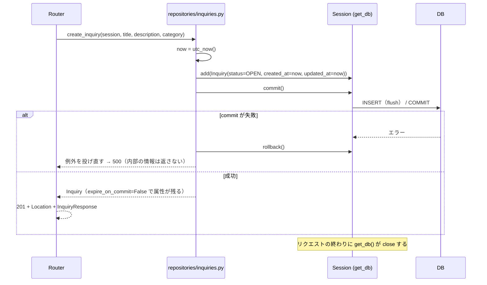

# Demo 2 Step 4 — 問い合わせの書き込み API

| 項目 | 内容 |
|---|---|
| 状態 | 完了 |
| 実施日 | 2026-10-07 |
| 前提 | [Demo 2 Step 3](step3-read-api.md)（読み取り API）完了 |

## 1. 目的とスコープ

Step 3 の読み取り API に、問い合わせの登録とステータス変更を加えます。Step 2 から引き継いだ「書き込みではトランザクション境界を明示する」方針を、ここで実装します。

**やること**

- `POST /inquiries`（登録）
- `PATCH /inquiries/{id}/status`（ステータス変更）
- 入力スキーマ `InquiryCreate`、`InquiryStatusUpdate`
- repository の書き込み関数と、commit / rollback の境界
- commit 失敗時の rollback を含むテスト

**やらないこと（後続 Step で実施）**

- DELETE、frontend との接続、`mock-data.ts` の削除、CORS、Docker、PostgreSQL / Azure、認証・認可

**変更していないもの：** DB のモデル、migration、seed、`get_db`、`/health`、`/health/ready`、frontend

## 2. 変更したファイル

既存の「1 リソースにつき schemas・repository・router を 1 ファイルずつ」という構成を保ち、それぞれに追加しました。

| ファイル | 変更内容 |
|---|---|
| `app/schemas/inquiry.py` | `InquiryTitle`・`InquiryDescription`（前後の空白を除いてから長さを検証）、`InquiryCreate`、`InquiryStatusUpdate` |
| `app/repositories/inquiries.py` | `create_inquiry()`、`update_inquiry_status()`、`_commit()`（commit に失敗したら rollback してから例外を投げ直す） |
| `app/routers/inquiries.py` | `POST /inquiries`（201 と `Location`）、`PATCH /inquiries/{inquiry_id}/status`。404 の生成を `_not_found()` にまとめた |
| `tests/conftest.py` | `fail_writes` fixture（commit を DB 側で失敗させるトリガーを追加する） |
| `tests/db/test_inquiry_write_repository.py` | 新規。書き込み repository のテスト |
| `tests/test_inquiries_write_api.py` | 新規。書き込み API のテスト |
| `tests/test_inquiries_api.py` | OpenAPI のテストで、`/inquiries` のメソッドの期待値を `{"get"}` から `{"get", "post"}` に更新 |

## 3. 技術判断

| 判断 | 理由 | 検討した代替案 |
|---|---|---|
| **書き込み関数ごとに 1 トランザクションとし、repository の中で commit する** | 境界が repository の中で完結し、読めばわかる。ルーターは HTTP の処理だけになる。rollback を repository だけでテストできる | ルーターで `with db.begin():` を使う（問い合わせを一度でもした Session で `begin()` を呼ぶと `InvalidRequestError` になり、取得してから更新する PATCH では壊れやすい）／`get_db()` で自動 commit（境界が暗黙になる）／service 層（複数のテーブルをまとめる処理がまだないので、層が増えるだけ） |
| **commit に失敗したら必ず rollback してから例外を投げ直す**（`_commit()`） | commit に失敗した Session は rollback するまで `PendingRollbackError` を出す。rollback で Session を再び使える状態に戻す | `get_db()` の close に任せる（同じ Session を続けて使う場合に壊れたままになる） |
| `flush()` と `refresh()` は明示的に呼ばない | id は commit の中で行われる flush で決まる。`expire_on_commit=False` なので commit 後も属性が残り、値はすべてアプリ側で決めている（DB 側で決まる値がない）。DB との一致は、別の Session で読み直すテストで確かめる | commit の後に `refresh()`（余計な SELECT が増える） |
| 登録時は `utc_now()` を 1 回だけ呼び、`created_at` と `updated_at` に同じ値を入れる | Step 2 で残した「モデルの default がそれぞれ `utc_now()` を呼び、マイクロ秒単位でずれる」問題を解消する | モデルの default に任せる |
| **status が実際に変わった場合だけ `updated_at` を明示的に設定する。`onupdate` は安全網としてモデルに残す** | 意図がコードから読める。同じ status の判定と同じ場所で制御できる | `onupdate` に任せる |
| **同じ status への PATCH は 200 を返し、何も更新しない**（UPDATE も commit もしない） | `updated_at` が「内容が最後に変わった時刻」という意味を保ち、冪等になる。frontend のフォームは変更しなくても送信でき、そのとき今と同じ「更新しました」が表示される | 毎回 `updated_at` を更新する（「最後に操作した時刻」になってしまう） |
| **POST は 201 と相対パスの `Location: /inquiries/{id}`** | HTTP の慣例（RFC 9110）に沿い、相対パスなのでリバースプロキシの影響を受けない | 付けない／`request.url_for()` で絶対 URL にする（プロキシの後ろでスキームやホストを取り違えるおそれがある） |
| 入力は `extra="forbid"`。id・status・createdAt・updatedAt は受け付けない | サーバーが決める値を、クライアントが上書きできないようにする | 無視する（送っても効かないことに気づけない） |
| 入力スキーマにも `alias_generator=to_camel` を付けるが、`populate_by_name` は付けない | API の JSON は camelCase に統一する。snake_case のキー（`created_at`）は未定義の項目として 422 になる | snake_case も受け付ける |
| 文字列は `StringConstraints(strip_whitespace=True, min_length=1, max_length=N)` | 前後の空白を除いてから長さを検証する（その場で確認済み）。長さは `len()`（コードポイント単位）で数え、Demo 1 の `countChars` と一致する | `field_validator` で自分で書く |
| DB の例外はルーターで捕まえず、Starlette の標準の 500 に任せる | 内部の情報を返さない（Step 3 と同じ）。repository で rollback 済み | 独自の例外ハンドラー（必要になったら検討） |
| 同時に更新された場合は、後から commit した方が残る | このデモでは十分 | 楽観ロック（バージョンのカラム） |

### トランザクションの流れ

## 4. API 仕様

### `POST /inquiries`

**本文（JSON）**

| 項目 | 型 | 検証 |
|---|---|---|
| `title` | string | 必須。前後の空白を除いて 1〜100 文字 |
| `description` | string | 必須。前後の空白を除いて 1〜2000 文字。途中の改行は残す |
| `category` | `ACCOUNT` / `NETWORK` / `SOFTWARE` / `OTHER` | 必須 |

上記以外の項目（`id`、`status`、`createdAt`、`updatedAt`、`created_at` など）は 422（`extra_forbidden`）です。

| 応答 | 条件 |
|---|---|
| `201`、`InquiryResponse`、`Location: /inquiries/{id}` | 登録した。status は `OPEN`、`createdAt == updatedAt` |
| `422` | 検証エラー（`missing`、`string_type`、`string_too_short`、`string_too_long`、`enum`、`extra_forbidden`、`json_invalid`） |
| `500` `Internal Server Error`（text/plain） | DB の障害・commit の失敗。rollback 済みで、内部の情報は返さない |

### `PATCH /inquiries/{inquiry_id}/status`

本文は `{"status": "OPEN" | "IN_PROGRESS" | "CLOSED"}` だけです。ほかの項目は 422 になります。

| 応答 | 条件 |
|---|---|
| `200` `InquiryResponse` | 変更した（`updatedAt` が新しくなり、`createdAt` は変わらない）。同じ status の場合は何も更新せず、現在の内容を返す |
| `404` `{"detail":"Inquiry not found"}` | 存在しない id |
| `422` | 不正な id（Step 3 の `InquiryId`：1〜2147483647）、不正な status、status がない、未定義の項目 |
| `500` | DB の障害・commit の失敗（rollback 済み） |

## 5. 検証結果

確認日：2026-10-07（macOS / Python 3.11.9）。パッケージの追加はありません。

### 自動テスト

| 確認内容 | 結果 |
|---|---|
| `pytest -q` | **111 passed**（Step 3 までの 68 件と、Step 4 で追加した 43 件） |
| `pytest -q -W error::DeprecationWarning` | 111 passed |
| `alembic check` | `No new upgrade operations detected.`（モデル・migration の変更なし） |

| ファイル | 件数 | 確認すること |
|---|---|---|
| `tests/db/test_inquiry_write_repository.py` | 6 | 登録（id、OPEN、`created_at == updated_at`、UTC、別の Session で読み直しても同じ）、登録の commit 失敗時の rollback（件数 0、`session.new` が空、Session が再び使える）、status の変更（`updated_at` だけ進み、別の Session でも同じ）、同じ status では UPDATE 文が実行されない、存在しない id は `None`、status 変更の commit 失敗時の rollback（属性が DB の値に戻る、Session が再び使える） |
| `tests/test_inquiries_write_api.py` | 37 | POST：201・`Location`・camelCase・`Z` 付きの UTC・永続化（seed の後の id は 9、一覧の先頭）・前後の空白の除去・title 100 / 101・description 2000 / 2001・空白だけ（4 パターン × 2 項目）・必須項目・不正な category・型の誤り・受け付けない項目 6 種類・JSON でない本文。PATCH：OPEN → IN_PROGRESS → CLOSED・永続化・`createdAt` は変わらず `updatedAt` は進む・同じ status・404・不正な id 4 種類・不正な status と status がない・未定義の項目。commit 失敗：POST と PATCH が 500 で内部の情報を含まず、その後の GET で変更されていない。OpenAPI |

**rollback のテストが本当に効いているかの確認：** `_commit()` から `session.rollback()` を一時的に外して実行したところ、rollback のテスト 2 件が失敗しました（`PendingRollbackError`）。元に戻すと 6 件とも通ります。テストが rollback の有無を検出できていることを確かめました。

### 実際のサーバーでの確認（一時 DB を使用）

`data/app.db` を変えないよう、`DATABASE_URL` を scratchpad の一時 SQLite に向け、`alembic upgrade head` と seed を実行してから uvicorn で確認しました。

| # | 確認内容 | 結果 |
|---|---|---|
| 1〜6 | POST（title と description の前後に空白） | `201`、`location: /inquiries/9`、status は `OPEN`、`createdAt == updatedAt == "2026-10-06T15:30:40.935838Z"`、title と description は前後の空白が除かれ、途中の改行は残る |
| 7 | title 100 文字 / 101 文字 | 201 / 422 `string_too_long` |
| 8 | description 2000 文字 / 2001 文字 | 201 / 422 `string_too_long` |
| 9 | 空白だけの title と description | 422 `string_too_short`（2 項目とも） |
| 10 | 不正な category | 422 `enum` |
| 11 | status・id・createdAt・updatedAt を送る | 422 `extra_forbidden`（4 項目とも） |
| 12〜14 | PATCH 9：OPEN → IN_PROGRESS → CLOSED | どちらも 200。`createdAt` は変わらず、`updatedAt` は `...40.935838Z` → `...41.037017Z` → `...41.050357Z` |
| 15 | 同じ status（CLOSED → CLOSED） | 200 で、`updatedAt` は `...41.050357Z` のまま |
| 16 | `PATCH /inquiries/999/status` | 404 |
| 17 | `PATCH /inquiries/abc/status`、`/9223372036854775808/status` | 422 |
| 18 | 不正な status | 422 `enum` |
| 19 | 未定義の項目（`title`） | 422 `extra_forbidden` |
| 20〜23 | 一時 DB に失敗させるトリガーを入れて POST と PATCH | どちらも `500 Internal Server Error`（text/plain、21 バイト）。サーバーログには `IntegrityError: forced failure` が出るが、レスポンスには含まれない。直後の GET で件数は 11 のまま、id 1 は `OPEN` のまま。確認後にトリガーを削除 |
| 24 | GET で永続化を確認 | `GET /inquiries/9` が PATCH 後の内容を返す。一覧は 11 件で、先頭は 11、10、9 |
| 25 | OpenAPI | `POST /inquiries`（201 に `Location` ヘッダー、422、本文 `InquiryCreate`）、`PATCH /inquiries/{inquiry_id}/status`（200、404、422、本文 `InquiryStatusUpdate`）。`InquiryCreate` は title が minLength 1 / maxLength 100、description が 1 / 2000、`additionalProperties: false` |

### 開発用 DB と frontend

| 確認内容 | 結果 |
|---|---|
| `backend/data/app.db` | 実装前と同じ（SHA-256 `9641ac22...4440`、更新時刻 `Oct 6 23:24:13`、8 件、`max(updated_at)` は `2026-10-03 06:10:00`）。Git 管理の対象外 |
| frontend | 差分なし |

### 実装・検証中に見つかった問題と対応

#### 問題 1：Step 3 の OpenAPI テストが POST の追加で失敗した

**現象**

`tests/test_inquiries_api.py::test_openapi_describes_inquiry_endpoints` が `assert {'get', 'post'} == {'get'}` で失敗しました。

**原因**

Step 3 のテストは、`/inquiries` が読み取り専用（GET だけ）であることを確かめていました。Step 4 で POST を追加したのは意図した仕様変更で、不具合ではありません。

**対応**

期待値を `{"get", "post"}` に更新し、POST は Step 4 で追加したこと、書き込みのテストは別ファイルにあることをコメントで残しました。`/inquiries/{inquiry_id}` が GET だけであることを確かめる部分は、そのまま残しています（PATCH は別のパス `/status` のため）。

## 6. Step 5 への引き継ぎ

Step 5 では、Next.js の frontend の repository（`frontend/src/lib/inquiries/repository.ts`）を FastAPI に接続します。

| 項目 | 内容 |
|---|---|
| `API_BASE_URL` | サーバー側だけで使う環境変数（`NEXT_PUBLIC_` は付けない。repository は Server Component と Server Action からしか呼ばれない）。既定値は `http://localhost:8000`。`frontend/.env.local` は既存の `.gitignore` で除外済み。Next.js 16 の `fetch` やキャッシュの仕様は、`frontend/AGENTS.md` の指示に従って `node_modules/next/dist/docs/` で確認してから実装する |
| `getInquiries` | `GET /inquiries?q=&status=` を呼び、結果を `Inquiry[]` に変換する。常に最新を表示するためキャッシュしない |
| `getInquiryById` | `/^\d+$/` に一致しない id は API を呼ばずに `null` を返す（422 を避けるため）。404 も `null` にする |
| `createInquiry` | `POST /inquiries` を呼ぶ。201 の本文の `id` を文字列にして詳細画面へ移動する（`Location` は使わなくてよい） |
| `updateInquiryStatus` | `PATCH /inquiries/{id}/status` を呼ぶ。404 は `null`、200 は `Inquiry` にする。同じ status でも 200 なので、今の「ステータスを更新しました」の表示がそのまま使える |
| id の型 | API は integer、frontend は string。変換は repository の 1 か所（`toInquiry(json)`）で行う |
| camelCase | API と frontend の型でキーが一致する。`updatedAt` を frontend の型に加えるかを決める |
| 検証の分担 | frontend の `validation.ts` は残す（項目ごとに日本語のエラーを表示するため、また API を呼ぶ前に弾くため）。backend は最後の砦で、上限（100 / 2000）と数え方（コードポイント単位）は両方で一致している。frontend の検証を通ったのに backend が 422 を返した場合は、「登録に失敗しました」として扱う |
| エラー | 通信の失敗と 5xx は、今の `catch` の処理（「時間をおいて再度お試しください」）に合流させる |
| `mock-data.ts` | 接続して確認が済んでから削除する（データは backend の seed が引き継いでいる）。frontend の README も更新する |
| CORS | ブラウザから直接 API を呼ばない（Next.js のサーバーから呼ぶ）ので不要の見込み。Step 5 で確認する |
| 起動手順 | backend と frontend の 2 つのプロセスを起動する手順を、ルートの README にまとめる |
