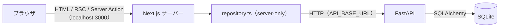

# Demo 2 Step 5 — Next.js frontend と FastAPI backend の接続

| 項目 | 内容 |
|---|---|
| 状態 | 実装・自動検証まで完了（ブラウザでの受入確認は人間が実施） |
| 実施日 | 2026-10-07 |
| 前提 | [Demo 2 Step 4](step4-write-api.md)（書き込み API）完了 |

## 1. 目的とスコープ

frontend の `src/lib/inquiries/repository.ts` が使っていたインメモリのモックデータを、FastAPI の REST API に置き換えます。



**やること**

- `repository.ts` の 4 つの関数を API 呼び出しに置き換える（シグネチャは変えない）
- `API_BASE_URL` の導入
- `error.tsx` の追加
- 検索キーワードの上限
- `mock-data.ts` の削除

**変更していないもの：** ページ、Server Actions（`actions.ts`）、Client Component（`InquiryForm`・`InquiryStatusForm`）、`types.ts`、backend のすべて

**やらないこと：** Docker、PostgreSQL、GitHub Actions、Azure、認証、frontend の自動テストの導入

## 2. 変更したファイル

| ファイル | 区分 | 内容 |
|---|---|---|
| `frontend/src/lib/inquiries/repository.ts` | 書き直し | `server-only`、API の型（`ApiInquiry`）と `toInquiry()`、共通処理（`request` / `getApiBaseUrl` / `ensureOk` / `readJson`）、4 つの関数 |
| `frontend/src/lib/inquiries/mock-data.ts` | 削除 | 初期データは backend の `app/db/seed_data.py` が引き継ぐ。元のファイルはタグ `demo-1` に残っている |
| `frontend/src/lib/inquiries/validation.ts` | 変更 | `QUERY_MAX_LENGTH = 200`。`parseInquiryQuery` で q をコードポイント単位で 200 文字に切り詰める |
| `frontend/src/components/inquiries/InquirySearchForm.tsx` | 変更 | q の入力欄に `maxLength={QUERY_MAX_LENGTH}` |
| `frontend/src/app/error.tsx` | 新規 | 予期しないエラーのときの画面 |
| `frontend/.env.example` | 新規 | `API_BASE_URL` の説明 |
| `frontend/.gitignore` | 変更 | `!.env.example` を追加（もとは `.env*` で `.env.example` まで除外されていた） |

## 3. 技術判断

| 判断 | 理由 | 検討した代替案 |
|---|---|---|
| repository の**中身だけ**を置き換え、シグネチャは変えない | Demo 1 で「API に置き換えるときの変更点」として設計した境界。ページ・Server Actions・コンポーネントを変えずに済む | ページ側で `fetch` する |
| API は Next.js のサーバー側からだけ呼ぶ（`import "server-only"`、`NEXT_PUBLIC_` は付けない） | ブラウザに API の URL を公開しない。CORS が要らない。`server-only` で、誤って Client Component から import するとビルドエラーになる | ブラウザから直接呼ぶ（CORS と API の公開が必要になる） |
| `server-only` のパッケージは追加しない | Next.js 16 では、パッケージのインストールは任意（同梱ドキュメント `05-server-and-client-components.md`）。`tsc` と `lint` も通った | パッケージを追加する |
| API の JSON は `unknown` として受け取り、`toInquiry()` で検証してから変換する。ライブラリは使わない | API は別のプロセスなので、信頼の境界になる。項目の型、category と status が既知の値か、日時が `Z` 付きの ISO 8601 かを確かめ、`undefined` や未知の値が画面に渡るのを防ぐ | 型アサーションだけ（実行時の保証がない）／zod（依存が増える） |
| **id は repository で `String(api.id)` に変換する** | frontend は id を文字列として扱っている（URL、hidden input） | frontend の型を number に変える（影響範囲が広い） |
| **`updatedAt` は検証するが、`Inquiry` 型には含めない** | 画面で使っていない。Step 5 は UI を変えない方針 | `Inquiry` 型に追加する（使うときに追加すればよい） |
| **不正な id（`0`、`01`、`-1`、`1.5`、`1e3`、`abc`、2147483647 超）は API を呼ばずに `null`** | 先頭が 0 の `01` は backend では 1 になるので、同じ問い合わせに 2 つの URL ができるのを防ぐ（Demo 1 と同じく「見つからない」扱い）。backend の 422 を避ける | API に任せ、422 を `null` に変換する |
| 詳細と PATCH の 404 は `null`。それ以外の失敗はすべて例外 | 既存のページ（`notFound()`）と Server Action（`null` なら「見つかりません」、例外なら「失敗しました」）の約束どおり | |
| **例外のメッセージにはメソッド・パス・ステータスだけを入れ、API の本文は入れない** | API の内部の情報がログや画面に広がらないようにする | 本文を含める |
| **`fetch` には `cache: "no-store"` を明示する** | §4 を参照 | 既定（`auto no cache`）のまま |
| Server Action の `revalidatePath` / `redirect` は残す | Server Action の後に今の画面を描画し直し（ステータスのバッジ）、一覧のキャッシュも無効にする。`no-store` とは役割が違う | 削除する |
| **タイムアウトは 10 秒**（`AbortSignal.timeout`） | API が応答しないときに、ページが止まり続けないようにする | 設けない |
| `API_BASE_URL` は呼び出すたびに読み、不正なら例外にする | モジュールを読み込んだ時点で評価すると、設定の誤りでビルドや import 全体が失敗する。理由はサーバーのログに出る | 起動時に検証する（Step 6 で本番では必須にするときに再検討する） |
| `API_BASE_URL` は末尾の `/` を除いてから文字列としてつなげる | `new URL(path, base)` は、`http://host/api/` のような基準 URL のパス（`/api`）を落としてしまう | `new URL()` |
| **検索キーワードは 200 文字に切り詰める**（`maxLength` と `parseInquiryQuery`） | backend の上限（201 文字以上は 422）を超えたときに、エラー画面にしないため。コードポイント単位で切り詰め、サロゲートペアを分割しない | 何もしない（エラー画面になる）／0 件として扱う |
| **`error.tsx` は `src/app/error.tsx` に置き、`retry()` を使う** | ルートレイアウト（ヘッダー）の内側のすべてのページが対象になる。Next.js 16.3.8 では `retry()`（再取得してから再描画）が推奨で、`reset()` は再取得しない | `/inquiries/error.tsx`、`reset()` |
| `error.tsx` では `error.message` を表示せず、`digest` だけを「エラー ID」として表示する | 開発中は元のメッセージがブラウザに届くので、表示すると内部の情報が出てしまう。digest はサーバーのログと照らし合わせるための ID | メッセージを表示する |
| frontend の自動テストのライブラリは導入しない | Demo 1 の方針（追加の依存なし）と揃える。`server-only` と `fetch` を差し替える仕組みが必要になるので、CI と一緒に Step 6 以降で判断する。今回は静的チェック、実際の API、偽の API、統合確認で検証した | Vitest や Playwright を今回入れる |

## 4. Next.js 16.3.8 のキャッシュについての調査

`next.config.ts` では Cache Components が無効なので、`caching-without-cache-components.md` の仕様が適用されます。

| 確認内容 | 結果 |
|---|---|
| `fetch` の既定の動作（`fetch.md`） | `auto no cache`。ルートが静的に事前描画されると、`next build` のときに 1 回だけ取得する。Request-time API を使うルートでは毎回取得する |
| Request-time API（`04-glossary.md`） | `cookies()`、`headers()`、`searchParams`、`draftMode()`。`params` は含まれない |
| ルートの分類（`next build`） | `/inquiries` と `/inquiries/[id]` は `ƒ`（Dynamic）、`/` と `/inquiries/new` は `○`（Static） |
| 実験（scratch に複製したプロジェクトで、既定の `fetch` のまま `next start`） | 詳細を表示 → API で直接 status を変更 → 再表示すると、変更がすぐ反映された。**今の構成では、`no-store` がなくても古いデータは表示されない** |

**それでも `no-store` を明示する理由：**

1. 問い合わせは、ほかの利用者や API から直接変更されうる共有データなので、キャッシュしないことをコードで宣言しておく。
2. 将来、`generateStaticParams` を足したり、静的なページで API を呼んだりして、ルートが静的と判定されると、既定の動作では `next build` のときに取得した結果が固定される。そうなると、ビルドのときに backend が必要になる（CI や Docker でのビルドが失敗する）。
3. `fetch` の既定の動作は、バージョンによって変わってきた（v14 はキャッシュする、v15 以降はしない）。明示しておけば、ルートの判定や更新の影響を受けない。

実装後の `npm run build` は、backend を起動していない状態でも成功しました。ビルドのときに API を呼んでいないことの確認です。

画面の更新については、Server Action の後は `revalidatePath` / `redirect` で描画し直し、一覧に移動したときはルーターキャッシュ（`staleTimes.dynamic` の既定値は 0 秒）によって毎回取得します。開発サーバーでは、HMR の間に `fetch` の結果が再利用されることがあります（再読み込みで消える）。

## 5. エラーの扱い

| 発生する場所 | 状況 | 結果 |
|---|---|---|
| 一覧・詳細（Server Component） | API の停止、5xx、壊れた JSON、JSON でない応答、型の不一致、タイムアウト、`API_BASE_URL` の不正 | 例外 → HTTP 500 → `error.tsx`（「データを取得できませんでした」、再試行、エラー ID）。原因はサーバーのログにだけ出る |
| 詳細 | 不正な id、API の 404 | `null` → `notFound()` → `[id]/not-found.tsx`（HTTP 404） |
| 登録（Server Action） | 例外 | 「登録に失敗しました。時間をおいて再度お試しください。」。入力した値は残る |
| ステータス変更（Server Action） | 例外 | 「更新に失敗しました。時間をおいて再度お試しください。」 |
| ステータス変更 | 不正な id、API の 404 | 「問い合わせが見つかりません」 |

## 6. 検証結果

確認日：2026-10-07（macOS、Node.js v22.21.1、Next.js 16.3.8、Python 3.11.9）。

**どの検証も、scratchpad に作った一時 DB（`alembic upgrade head` と seed 済み）に対して行いました。** `backend/data/app.db` は使っていません。

### 静的チェックと回帰

| 確認内容 | 結果 |
|---|---|
| `npx tsc --noEmit` | エラーなし |
| `npm run lint` | エラーなし |
| `npm run build` | 成功（backend は起動していない）。`/inquiries` と `/inquiries/[id]` は `ƒ` |
| backend の `pytest -q` | 111 passed |
| backend の `pytest -q -W error::DeprecationWarning` | 111 passed |
| `alembic check` | `No new upgrade operations detected.` |
| `mock-data` / `MOCK_INQUIRIES` への参照 | なし（`grep -rn` の結果が空） |
| ブラウザ向けファイル（`.next/static`） | `localhost:8000`、`API_BASE_URL`、`127.0.0.1` は 0 ファイル。サーバー側（`.next/server`）にだけ含まれる。`8000` という文字列が 1 ファイルにあったが、React 内部のビットフラグ（`0x8000000`）だった |
| frontend から DB への参照 | `src`・`package.json`・`.env.example` に `sqlite`、`app.db`、`DATABASE_URL`、DB のドライバはない。`fetch` を呼んでいるのは `repository.ts` だけ |
| `backend/data/app.db` | 実装前後で SHA-256（`9641ac22…4440`）、更新時刻（`Oct 6 23:24:13`）、件数（8）が同じ |

### 実際の API での確認（`next start` と uvicorn）

| 確認内容 | 結果 |
|---|---|
| 一覧 | id の順は 7, 6, 5, 8, 3, 2, 1, 4。件数の表示は 8 |
| キーワード検索 | `q=vpn` → [5]、`q=アカウント` → [8, 4] |
| status での絞り込み | `status=CLOSED` → [8, 4] |
| q と status | `q=できない&status=OPEN` → [7, 1] |
| 空白だけの q と未知の status | 全件。API にはパラメータなしの `GET /inquiries` が送られる |
| 一致なし | 0 件の表示 |
| q が 250 文字 | API に送る q は 200 文字。入力欄は `maxLength="200"` で、値は 200 文字 |
| 詳細 | `/inquiries/1` が表示される（日本時間 2026/09/28 09:15）。フォームに渡す id は文字列 `"1"` |
| 404 | `/inquiries/999` と `/2147483647` は API の 404 から「見つかりません」 |
| 不正な id | `0`、`01`、`abc`、`1.5`、`-1`、`2147483648`、`1e3` は HTTP 404 で、**API は呼ばれない**（uvicorn のアクセスログで確認） |
| 登録 | JavaScript なしのフォーム送信で Server Action を呼ぶと、303 で `/inquiries/9` へ移動。前後の空白は除かれ、一覧の先頭に表示される。frontend の検証エラーのときは API を呼ばない |
| ステータス変更 | 9 番を OPEN → IN_PROGRESS → CLOSED。どちらも「ステータスを更新しました」で、再読み込みしても維持される。同じ status への変更では、API の `updatedAt` が変わらない |
| 改ざんした id でのステータス変更 | hidden の id が `999` のときは API の 404 から「問い合わせが見つかりません」。`abc` と `01` のときは API を呼ばずに同じ表示 |

### 異常系（API の停止と、scratchpad の偽の API）

| 状況 | 結果 |
|---|---|
| API の停止 | 一覧と詳細は HTTP 500。ヘッドレス Chrome（一時プロファイル）で JavaScript を実行した後の DOM に、`error.tsx` の見出し・再試行・エラー ID・ヘッダーがある。HTML に `localhost:8000`、`ECONNREFUSED`、`fetch failed` は含まれない。登録すると「登録に失敗しました…」 |
| 500（本文に `SECRET_DB_ERROR …` を入れた） | 500 → `error.tsx`。本文は画面にもサーバーのログにも出ない |
| 壊れた JSON、HTML の応答 | 500 → `error.tsx`（ログ：`Invalid JSON in API response`） |
| 型の誤り（id が文字列、status が未知、日時が UTC でない） | 500 → `error.tsx`（ログ：`Unexpected inquiry shape in API response`） |
| 一覧が配列でない | 500 → `error.tsx`（ログ：`response is not an array`） |
| 応答しない | 10 秒で 500 になる（ログ：`TimeoutError`） |
| 書き込みだけが失敗する（GET は正常） | 登録は「登録に失敗しました…」、ステータス変更は「更新に失敗しました…」。内部の情報は出ない |

### `API_BASE_URL`

| 値 | 結果 |
|---|---|
| 未設定、`""`、`"   "` | 既定値で接続できる |
| `http://localhost:8000`、`…/`、`…///`、前後に空白 | 接続できる |
| `http://localhost:8001/api/` | 偽の API に `/api/inquiries` として届く（パスが保持される） |
| `not a url`、`localhost:8000`、`ftp://…`、`…?x=1`、`…/#a` | 500 → `error.tsx`。理由（`API_BASE_URL が不正です…`）はサーバーのログにだけ出て、画面には出ない |

### 実装・検証中に見つかった問題と対応

#### 問題 1：`.env.example` が Git の管理対象にならない

**現象と原因：** `create-next-app` が作った `frontend/.gitignore` は、`.env*` ですべての env ファイルを除外していました。

**対応：** `!.env.example` を追加しました。`git check-ignore` で、`.env.example` は管理対象、`.env.local` は対象外であることを確かめています。

#### 問題 2：API を止めたとき、`curl` で取得した HTML に `error.tsx` の文言がない

**現象：** HTTP 500 の HTML に、「データを取得できませんでした」が含まれていませんでした。

**原因：** `error.tsx` は Client Component なので、サーバーで描画するときは Next.js が最小限の HTML を返し、ブラウザで JavaScript が動いてからエラー画面を描画します。HTML にはエラーの digest（`E{"digest":"…"}`）と `error.tsx` のチャンクへの参照が含まれていることを確かめました。

**対応：** コードの修正は不要です。ヘッドレス Chrome（ユーザーのプロファイルとは別の一時プロファイル）で JavaScript を実行した後の DOM を取得し、`error.tsx` が描画されることを確かめました。JavaScript が無効な環境では、Next.js の最小限の 500 の画面になります。

#### 問題 3：API 全体が止まっているとき、JavaScript なしでステータスを変更すると、メッセージではなく 500 になる

**現象：** 偽の API がすべてのリクエストを失敗させている状態で、JavaScript なしのフォーム送信でステータスを変更すると、「更新に失敗しました」ではなく HTTP 500 になりました。

**原因：** Server Action 自体は例外を捕まえて「更新に失敗しました」を返していました。しかし、JavaScript なしの送信では、Server Action の後にページ全体を描画し直します。そのとき詳細ページの `GET /inquiries/{id}` も失敗するので、ページの描画が 500 になっていました。偽の API で、GET は成功させ PATCH だけを失敗させたところ、「更新に失敗しました…」が表示されることを確かめ、切り分けました。

**対応：** 不具合ではなく、「API 全体が止まっていればページも表示できない」という正しい動作です。JavaScript が有効なブラウザでの見え方は、人間の受入確認の項目に入れました（§7）。

## 7. ブラウザでの受入確認（人間が実施）

```bash
# backend
cd backend && source .venv/bin/activate && uvicorn app.main:app --port 8000
# frontend
cd frontend && npm run build && npm start      # または npm run dev
```

開発者ツールの Network タブを開き、「Preserve log」をオンにして確認します。

| # | 操作 | 期待する結果 |
|---|---|---|
| 1 | 一覧 | seed の 8 件が新しい順に並ぶ |
| 2 | キーワード「vpn」 | 1 件 |
| 3 | ステータス「完了」 | 2 件 |
| 4 | タイトルをクリック | 詳細が表示される（日時は日本時間） |
| 5〜7 | 新規登録 → 詳細へ移動 → 一覧へ戻る | 登録した内容が先頭にある |
| 8 | ステータスを変更 | 「ステータスを更新しました」と表示され、バッジが変わる |
| 9 | 再読み込み、backend の再起動 | ステータスが維持されている |
| 10 | uvicorn を止めて一覧を再読み込み | 日本語のエラー画面。uvicorn を再び起動して「再試行」を押すと、一覧が表示される |
| 10b | uvicorn を止めて、詳細でステータスを変更・新規登録 | 「更新に失敗しました…」「登録に失敗しました…」（JavaScript が有効な状態での表示を確認） |
| 11 | `/inquiries/999`、`/abc`、`/01` | 「問い合わせが見つかりません」 |
| 12 | Network タブを「8000」で絞り込む | 0 件。通信先は `localhost:3000` だけ（ドキュメント、`?_rsc=`、`Next-Action` ヘッダー付きの POST） |
| 13 | uvicorn のログ | 画面を操作したタイミングで `127.0.0.1` から API が呼ばれている |

`backend/data/app.db` に登録や変更が書き込まれます。初期状態に戻す場合は、`backend/` で `alembic downgrade base && alembic upgrade head && python -m app.db.seed` を実行します。

## 8. Step 6 への引き継ぎ

| 候補 | 引き継ぐ内容 |
|---|---|
| Docker | backend と frontend を Compose で起動し、`API_BASE_URL=http://backend:8000` にする。backend のポートは外部に公開しなくてよい（ブラウザから直接呼ばないため）。SQLite は volume に置く。`no-store` にしているので、`next build` のときに backend は不要（確認済み） |
| PostgreSQL | Step 2 の §9 のとおり、`DATABASE_URL` と `psycopg` を変える |
| CI | backend は `pytest` と `alembic check`、frontend は `tsc`、`lint`、`build`。frontend の自動テスト（Vitest で repository の単体テスト、Playwright で §7 の E2E）を導入するかを判断する |
| Azure | **本番では `API_BASE_URL` を必須にする**（既定値の `localhost` に気づかず接続しないように）。backend への経路を非公開にするか、タイムアウトの値、ログの集約（digest で照らし合わせる）も検討する |
| その他 | 画面に `updatedAt` を表示するか、`loading.tsx`、認証・認可。HTML の `maxLength` は UTF-16 の単位で数えるので、絵文字が多い検索語ではブラウザ側の上限がサーバーより厳しくなる（実害はない） |
