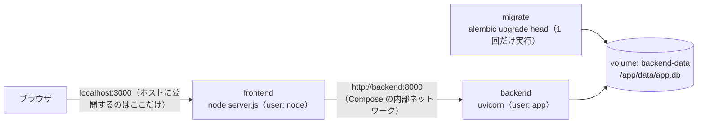

# Demo 2 Step 6A — frontend / backend の Docker 化（DB は SQLite）

| 項目 | 内容 |
|---|---|
| 状態 | 実装・自動検証まで完了（ブラウザでの受入確認は人間が実施） |
| 実施日 | 2026-10-07 |
| 前提 | [Demo 2 Step 5](step5-frontend-api-integration.md)（frontend と FastAPI の接続）完了 |
| 環境 | Docker 28.5.1、Docker Compose v2.40.2-desktop.1（Docker Desktop、macOS） |

## 1. 目的とスコープ

frontend（Next.js）と backend（FastAPI）を、本番を想定したコンテナイメージにします。Docker Compose で、migration → backend → frontend の順に起動できるようにします。

**DB は SQLite のまま**とし、PostgreSQL 化は Step 6B で行います。コンテナ化の問題（ネットワーク、ビルド、パーミッション、ホスト名）と DB 方言の問題を切り分けるためです。

**やること：** Dockerfile と `.dockerignore`（frontend・backend）、`compose.yaml`、`next.config.ts` の standalone、README と docs

**やらないこと：** PostgreSQL、CI、Azure、開発用のコンテナ（開発は今までどおりホストで `npm run dev` と `uvicorn --reload`）

**変更していないもの：** アプリのコード（frontend・backend とも）、テスト、migration、seed、`backend/data/app.db`

## 2. 構成



| サービス | イメージ | 役割 | ホストへの公開 | healthcheck |
|---|---|---|---|---|
| `migrate` | `ai-support-desk-backend:local` | `alembic upgrade head` を実行して終了する | なし | — |
| `backend` | `ai-support-desk-backend:local`（ビルドはここだけ） | FastAPI | **なし**（`expose: 8000` は内部向けの記述だけ） | `/health/ready`（DB への接続を含む）を Python の `urllib` で確認 |
| `frontend` | `ai-support-desk-frontend:local` | Next.js（standalone） | `3000:3000` | `/` を `fetch` する（`redirect: "manual"`。backend を呼ばない） |

**起動の順番：** `migrate`（`service_completed_successfully`）→ `backend`（`service_healthy`）→ `frontend`

## 3. 変更したファイル

| ファイル | 区分 | 内容 |
|---|---|---|
| `frontend/next.config.ts` | 変更 | `output: "standalone"`（`npm start` の動作は変わらない） |
| `frontend/Dockerfile` | 新規 | `node:22-alpine` の 3 段階ビルド（`npm ci` → `npm run build` → standalone、`.next/static`、`public` だけをコピー）。`USER node`、`HOSTNAME=0.0.0.0`、`PORT=3000`、`node server.js` |
| `frontend/.dockerignore` | 新規 | `node_modules`、`.next`、`.env*`、`*.md` など |
| `backend/Dockerfile` | 新規 | `python:3.11-slim`。`requirements.txt` だけを入れる。`app`、`alembic`、`alembic.ini` をコピーする。root ではないユーザー `app`（uid 1001）。`/app/data` の所有者は `app` |
| `backend/.dockerignore` | 新規 | `.venv`、`__pycache__`、`.env*`、`data`（**開発用の `app.db` を入れない**）、`tests`、`*.md` など |
| `compose.yaml` | 新規 | 3 サービスと、volume `backend-data` |
| `README.md`、`backend/README.md`、`frontend/README.md`、`docs/README.md` | 変更 | Docker Compose での起動手順と目次 |

## 4. 技術判断

| 判断 | 理由 | 検討した代替案 |
|---|---|---|
| **Step 6 を 6A（Docker 化）と 6B（PostgreSQL 化）に分ける** | 問題の切り分け、Step 2 の「`DATABASE_URL` を変えるだけで移行できる」設計を 6B の差分として示せる、Step ごとのレビューのしやすさ | 一度に行う |
| 本番を想定した Dockerfile を 1 つずつ作り、開発はホストで行う | Next.js の同梱ドキュメント（`deploying.md`）が、Mac での開発には `npm run dev` を推奨している。ホットリロードやデバッガーも今までどおり使える | 開発用のコンテナや compose の override |
| frontend は `output: "standalone"` で 3 段階のビルド | 実行用のイメージに `node_modules` を丸ごと入れずに済む（同梱の `output.md`）。standalone には `public` と `.next/static` が含まれないので、個別にコピーする | `next start` と、`node_modules` を丸ごと入れる |
| **`API_BASE_URL` はイメージに入れず、実行時に渡す** | サーバー側の環境変数は実行時に読まれる（`self-hosting.md`）。同じイメージを Compose でも Azure でも使える。`NEXT_PUBLIC_` を付けないので、ブラウザ向けのコードにも入らない | ビルド時の引数で埋め込む |
| backend は実行時の依存だけを入れ、テストや開発用の依存は入れない | イメージを小さくし、攻撃の対象になる部分を減らす。テストはホストで実行する（6B で `test` ステージを足すかを検討する） | 開発用の依存も入れる |
| **root ではないユーザーで動かす**（frontend は `node`、backend は `app`） | コンテナが侵害されたときの被害を小さくする。backend のアプリのコードは所有者が root なので、`app` ユーザーからは書き換えられない | root で動かす |
| `/app/data` の所有者を `app` にしたうえで、名前付き volume をマウントする | 名前付き volume は、初めてマウントするときにイメージ側のディレクトリの所有者を引き継ぐ。root ではないユーザーでも SQLite に書き込める | bind mount（ホストのファイルの所有者に依存する。開発用の `app.db` と混ざるおそれがある） |
| **migration は専用の `migrate` サービスで行う** | Step 2 の「アプリの起動時に migration しない」方針を保ちつつ、Compose の起動手順として明示する。Azure の Container Apps Job にそのまま対応させられる | backend のエントリポイントで実行する |
| **seed は自動では実行せず、`docker compose run --rm backend python -m app.db.seed` で手動実行する** | Step 2 の方針どおり、本番を想定した構成で初期データを自動で入れない | `profiles: [seed]`、起動時の自動実行 |
| **backend のポートはホストに公開しない** | ブラウザから FastAPI に直接届かないことを、構成そのもので保証する。CORS も引き続き不要。ホストの uvicorn（8000）とも衝突しない | `127.0.0.1:8000` だけに公開する |
| backend の healthcheck は `/health/ready`。frontend は `service_healthy` を待つ | DB に接続できるようになってから frontend を起動する。slim イメージには curl がないので、Python で確認する | `/health`（liveness だけ） |
| frontend の healthcheck は `/` を `redirect: "manual"` で確認する | backend を呼ばない静的なページなので、frontend 自身の生存だけを確認できる | `/inquiries`（backend の状態に引きずられる） |
| **イメージをビルドするのは `backend` サービスだけ。`migrate` は同じイメージを `image:` と `pull_policy: never` で参照する** | 2 つのサービスに `build` を書くと、キャッシュのない初回に同じ名前のイメージのビルドが競合して失敗する（§6 の問題 1） | 両方に `build` を書く |

## 5. 検証結果

確認日：2026-10-07。**`backend/data/app.db` は使っていません**（Compose の SQLite は volume の中の別のファイル）。

### イメージ

| 確認内容 | frontend | backend |
|---|---|---|
| ビルド | backend を起動していない状態で成功（ビルド時に API を呼ばない） | 成功 |
| 実行ユーザー | `node`（uid 1000） | `app`（uid 1001） |
| サイズ（`docker image inspect` の Size／`docker image ls`） | 約 86 MB／330 MB | 約 67 MB／311 MB |
| `.env` ファイル | なし | なし |
| イメージの環境変数 | `NODE_ENV`、`NEXT_TELEMETRY_DISABLED`、`HOSTNAME`、`PORT` だけ（`API_BASE_URL` は含まない） | `PYTHON*`、`PIP_*` だけ |
| その他 | `.next/static` に `API_BASE_URL`、`localhost:8000`、`backend:8000` は 0 件。`localhost:8000`（repository の既定値）はサーバー側のファイルにだけ含まれ、Compose では上書きされる | `*.db`、`tests`、pytest は含まない。`/app/data` は空で、所有者は `app`。`DATABASE_URL` の既定値は `sqlite:////app/data/app.db` |

`docker image ls` のサイズには、展開後のディスク使用量が含まれるため大きく表示されます。

### 起動・ポート・接続

| 確認内容 | 結果 |
|---|---|
| `docker compose config --quiet` | OK |
| 起動の順番（開始・終了時刻） | migrate：01:37:38.404 に開始、38.957 に終了（終了コード 0）→ backend：39.017 に開始 → healthy → frontend：44.618 に開始 → healthy |
| `docker compose ps` | migrate は `Exited (0)`、backend は `Up (healthy)`（`8000/tcp`）、frontend は `Up (healthy)`（`0.0.0.0:3000->3000/tcp`） |
| ポートの割り当て | backend は `{}`、frontend は `{"3000/tcp":[{"HostPort":"3000"}]}` |
| ホスト → `localhost:3000` | 200 |
| ホスト → `localhost:8000` | 接続できない（curl の終了コード 7）。ホストで待ち受けているのは 3000 番だけ |
| frontend のコンテナ → `http://backend:8000/health/ready` | `200 {"status":"ok"}` |
| frontend のコンテナの `API_BASE_URL` | `http://backend:8000` |
| ブラウザに渡す HTML と JS（9 ファイル） | `backend:8000`、`localhost:8000`、`API_BASE_URL` は 0 件 |

### アプリの動作と永続化

| 確認内容 | 結果 |
|---|---|
| seed 前 | 一覧は 0 件（自動では投入されない） |
| `docker compose run --rm backend python -m app.db.seed` | 1 回目は「8 件の問い合わせを投入しました。」、2 回目は「既にデータがあるため seed をスキップしました。」 |
| 一覧・検索・詳細・404 | id の順は 7, 6, 5, 8, 3, 2, 1, 4。`q=vpn` → [5]。`/inquiries/1` は 200、`/inquiries/01` は 404 |
| 登録・ステータス変更（Server Action を JavaScript なしのフォーム送信で呼び出し） | 303 で `/inquiries/9` へ移動。「ステータスを更新しました」（IN_PROGRESS）。volume の中の `/app/data/app.db` に 9 件と `(9, 'IN_PROGRESS')`（ファイルの所有者は `app`） |
| `docker compose restart` | 9 件と、id 9 の「対応中」が残っている |
| `docker compose down` → `up -d` | volume は残り、9 件と「対応中」が残っている。migrate は再び実行され、適用済みなので何もせずに終了する |
| `docker compose down -v` → `up -d --build` | volume が削除され、一覧は 0 件になる。seed を手で実行すると 8 件に戻る |
| backend を止めたとき（`docker compose stop backend`） | `/inquiries` は HTTP 500。ヘッドレス Chrome で JavaScript を実行した後の DOM に、`error.tsx`（見出し、再試行、エラー ID、ヘッダー）があり、内部の情報は出ていない。frontend のログには `fetch failed` / `ENOTFOUND`（止まったコンテナは Compose の内部 DNS から外れるため、`ECONNREFUSED` ではない） |
| backend を再開したとき（`docker compose start backend`） | healthy に戻り、一覧も元に戻る。依存関係に従って migrate も再び実行される（何もせずに終了する） |

### ホストでの回帰

| 確認内容 | 結果 |
|---|---|
| backend の `pytest -q` | 111 passed |
| backend の `pytest -q -W error::DeprecationWarning` | 111 passed |
| `alembic check` | `No new upgrade operations detected.` |
| frontend の `npx tsc --noEmit`、`npm run lint`、`npm run build` | どれも終了コード 0。`.next/standalone/server.js` が作られる。`.next/static` に API の URL は 0 件 |
| `backend/data/app.db` | SHA-256 `9641ac22…4440`、`Oct 6 23:24:13`、8 件。Step 6A の前と同じ |
| `git diff --check` | 問題なし（新規ファイルにも末尾の空白はない） |

### 実装・検証中に見つかった問題と対応

#### 問題 1：キャッシュがない状態の初回の `docker compose up --build` が失敗する

**現象**

初回の `docker compose up -d --build` で、コンテナが 1 つも作られませんでした。2 回目は成功しました。キャッシュのイメージと volume を消して再現させたところ、次のエラーが出ました。

```
ERROR: image "docker.io/library/ai-support-desk-backend:local": already exists
target backend: failed to solve: image "docker.io/library/ai-support-desk-backend:local": already exists
```

**原因**

`migrate` と `backend` の両方に、`build: ./backend` と同じ `image: ai-support-desk-backend:local` を書いていました。Compose は 2 つのサービスのビルドを同時に行うので、後から終わった方が、同じ名前のイメージがすでにあるとして失敗し、`up` 全体が止まっていました。2 回目はビルドのキャッシュによってビルドが一瞬で終わり、たまたま競合しなかっただけでした。

**対応**

イメージをビルドするのは `backend` サービスだけにし、`migrate` は `image:` で同じイメージを参照するようにしました。さらに `pull_policy: never` を付け、ローカルにしかないイメージを Docker Hub から取得しようとしないようにしました。キャッシュのイメージも volume もない状態からの `up -d --build` を 2 回続けて実行し、どちらも成功すること（終了コード 0、backend のビルドは 1 回）を確かめました。理由は `compose.yaml` のコメントにも残しています。

## 6. ブラウザでの受入確認（人間が実施）

```bash
docker compose up -d          # volume には seed 済みの 8 件が残っている（なければ下記の seed を実行）
docker compose run --rm backend python -m app.db.seed
```

| # | 操作 | 期待する結果 |
|---|---|---|
| 1 | http://localhost:3000 を開く | 一覧に 8 件（新しい順） |
| 2 | 検索・絞り込み・詳細 | Step 5 と同じ結果 |
| 3 | 新規登録 → 詳細へ移動 → 一覧へ戻る | 登録した内容が先頭にある |
| 4 | ステータスを変更 → 再読み込み | 変更が残っている |
| 5 | `docker compose restart` → 再読み込み | データが残っている |
| 6 | `docker compose stop backend` → 再読み込み | 日本語のエラー画面 |
| 7 | `docker compose start backend` → 「再試行」 | 一覧に戻る |
| 8 | Network タブを「8000」で絞り込む | 0 件（通信先は `localhost:3000` だけ） |
| 9 | ブラウザで http://localhost:8000/docs を開く | 接続できない（backend は公開していない） |
| 10 | `docker compose down` → `up -d` | データが残っている |

## 7. Step 6B / Step 7 への引き継ぎ

| 項目 | 内容 |
|---|---|
| PostgreSQL（6B） | `db` サービス（`postgres`、`pg_isready`、volume `pgdata`、**ポートは公開しない**）を追加し、起動順を `db`（healthy）→ `migrate` にする。`DATABASE_URL` は `.env`（Git の管理対象外）から組み立てる。`psycopg[binary]` を追加する。テストを DB に依存しない形にし、PostgreSQL では専用の `db-test` で実行する |
| 6A の構成で 6B でも使うもの | 両方の Dockerfile、`migrate` → `backend` → `frontend` の起動順と healthcheck、backend を公開しない構成、`API_BASE_URL=http://backend:8000` |
| 6B で役目を終えるもの | volume `backend-data`（PostgreSQL では `pgdata` に置き換わる） |
| イメージのバージョンの固定 | 今は `node:22-alpine` と `python:3.11-slim` のタグだけ。CI か Azure の段階で、マイナーバージョンや digest まで固定するかを判断する |
| Azure（Step 7） | Dockerfile とイメージ（ACR に push し、Container Apps で動かす）、`migrate`（Container Apps Job）、`/health` と `/health/ready`（プローブ）、backend を内部向けの ingress だけにする構成は、そのまま使える。**本番では `API_BASE_URL` を必須にする**（今は既定値が `localhost:8000`） |
| ビルド時のネットワーク | frontend のビルドは `next/font/google` のため、インターネットへの接続が必要（CI でも同じ） |
