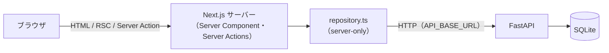
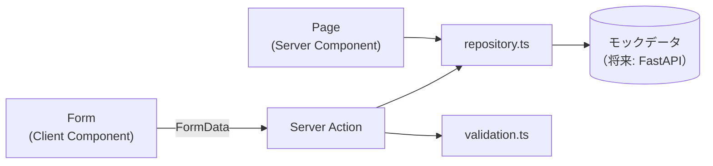

# AI Support Desk — Demo 1

社内ヘルプデスク担当者向けの問い合わせ管理 Web アプリです（Next.js 16 / App Router）。

人間が要件定義・設計承認・レビュー・受入判断を行い、ChatGPT と Claude Code を工程ごとに使い分けた **AI 支援開発** のプロセスを、小規模なアプリで一通り実践した面談用デモです。

> **Demo 2 Step 5 で、データの取得元をモックデータから FastAPI（[backend/](../backend/)）に置き換えました。** 現在の構成・起動方法は [Demo 2 での変更](#demo-2-での変更fastapi-との接続) と [ローカルでの起動方法](#ローカルでの起動方法) を参照してください。それ以外の節は Demo 1 時点の記録です（Demo 1 のコードはタグ `demo-1` に残っています）。

- [Demo 2 での変更（FastAPI との接続）](#demo-2-での変更fastapi-との接続)
- [Demo 1 の目的](#demo-1-の目的)
- [実装した機能](#実装した機能)
- [使用技術](#使用技術)
- [アーキテクチャ](#アーキテクチャ)
- [バリデーションとセキュリティ](#バリデーションとセキュリティ)
- [開発プロセスと AI の活用](#開発プロセスと-ai-の活用)
- [動作確認・テスト](#動作確認テスト)
- [ローカルでの起動方法](#ローカルでの起動方法)
- [Demo 1 の制約](#demo-1-の制約)
- [Demo 2 以降の拡張案](#demo-2-以降の拡張案)

## Demo 2 での変更（FastAPI との接続）

設計の詳細は [docs/demo2/step5-frontend-api-integration.md](../docs/demo2/step5-frontend-api-integration.md) を参照してください。



- `src/lib/inquiries/repository.ts` の中身を `fetch` による REST API 呼び出しに置き換えました。関数のシグネチャは変えていないため、ページ・コンポーネント・Server Actions は変更していません。`mock-data.ts` は削除しました（初期データは backend の seed が引き継いでいます）。
- API は Next.js のサーバー側からのみ呼び出します（`import "server-only"`、環境変数に `NEXT_PUBLIC_` を付けない）。ブラウザから FastAPI へは直接通信しないため、CORS の設定は不要です。
- API の id（integer）は repository で `String(id)` に変換します。`updatedAt` は応答の検証にのみ使い、画面の型には含めていません。
- 不正な id（`0`・`01`・数字以外・2147483647 超）は API を呼ばずに「見つかりません」として扱います。API の 404 も同じ扱いです。
- API の停止・5xx・不正な応答は例外とし、`src/app/error.tsx`（「データを取得できませんでした」＋再試行）を表示します。API のエラー内容は画面に表示しません。
- `fetch` は `cache: "no-store"` を明示し、常に最新のデータを取得します。登録・ステータス変更後の画面更新は、従来どおり Server Actions の `revalidatePath` / `redirect` で行います。
- 検索キーワードは 200 文字までとしました（API の上限に合わせ、超過分は切り詰め）。

| 環境変数 | 既定値 | 説明 |
|---|---|---|
| `API_BASE_URL` | `http://localhost:8000` | FastAPI の URL。サーバー側のみで使用。未設定・空の場合は既定値。末尾の `/` は任意。不正な値の場合はエラー画面になり、理由はサーバーログに出力されます |

`frontend/.env.example` を `frontend/.env.local` にコピーして上書きできます（`.env.local` は Git 管理対象外）。

## Demo 1 の目的

- 要件整理 → 設計 → レビュー → 実装 → 検証 → 受入 → コミットの工程を、Step 単位で一通り回す
- 後で Python / FastAPI の REST API に置き換えることを前提に、データアクセスの境界を先に設計する
- Demo 1 ではバックエンド API・DB を作らず、TypeScript のモックデータ（インメモリ）で動作させる

## 実装した機能

| 機能 | 内容 | URL |
|---|---|---|
| 問い合わせ一覧 | 作成日時の新しい順。カテゴリ・ステータスは日本語表示、日時は日本時間 | `/inquiries` |
| キーワード検索 | タイトル・本文の部分一致（大文字小文字を区別しない） | `/inquiries?q=` |
| ステータス絞り込み | 未対応 / 対応中 / 完了。キーワードと併用可 | `/inquiries?status=` |
| 詳細表示 | タイトル・問い合わせ内容・カテゴリ・ステータス・作成日時 | `/inquiries/{id}` |
| 404 処理 | 存在しない ID は専用の Not Found 画面（HTTP 404） | — |
| 新規問い合わせ登録 | 登録後は作成した問い合わせの詳細画面へ遷移。status は OPEN 固定 | `/inquiries/new` |
| 入力バリデーション | 必須・最大文字数・カテゴリ値をサーバー側で検証し、項目ごとにエラー表示 | — |
| ステータス変更 | 詳細画面から変更。詳細・一覧・検索結果に反映 | — |

`/` は `/inquiries` へリダイレクトします。

## 使用技術

- Next.js 16.3（App Router / Server Actions）、React 19.2
- TypeScript 5.9（strict）
- Tailwind CSS 4.3
- ESLint 9（eslint-config-next）

Create Next App の構成に対して、追加の npm パッケージは導入していません（フォーム・バリデーション・状態管理も標準機能で実装）。

## アーキテクチャ

### ディレクトリ構成

```
src/
├── app/
│   ├── page.tsx                  # / → /inquiries へリダイレクト
│   └── inquiries/
│       ├── page.tsx              # 一覧・検索・絞り込み
│       ├── actions.ts            # Server Actions（登録・ステータス変更）
│       ├── new/page.tsx          # 新規登録画面
│       └── [id]/
│           ├── page.tsx          # 詳細画面
│           └── not-found.tsx     # 存在しない ID 用の 404 画面
├── components/inquiries/         # 表示コンポーネント・フォーム
└── lib/inquiries/
    ├── types.ts                  # 型・定数・日本語ラベル
    ├── mock-data.ts              # 初期データ（8件）
    ├── repository.ts             # データアクセス層（FastAPI 置き換えポイント）
    ├── validation.ts             # 入力値の検証
    └── format.ts                 # 日時フォーマット
```

### 処理の流れ



### Server Component / Client Component / Server Actions の役割

| 種別 | 対象 | 役割 |
|---|---|---|
| Server Component | 各ページ、一覧・詳細・検索フォームなどの表示部品 | `searchParams` / `params` の受け取り、repository からのデータ取得、表示 |
| Client Component | `InquiryForm`、`InquiryStatusForm` の 2 つのみ | `useActionState` による送信中表示（二重送信防止）とエラー・完了メッセージ表示 |
| Server Actions | `createInquiryAction`、`updateInquiryStatusAction` | FormData の検証 → repository 呼び出し → `revalidatePath` / `redirect` |

検索フォームは `next/form` による GET フォームとし、検索条件は URL のクエリ（`q` / `status`）で管理しています。

### repository 層を設けた理由

- UI・Server Actions を「データをどこから取得するか（モック / API）」から切り離すため
- 関数シグネチャを REST API に対応させ、API 移行時の変更を 1 ファイルに限定するため
- repository は Server Component と Server Actions からのみ呼び出し、Client Component からは import しない

### FastAPI への置き換え想定

| repository の関数 | 想定する FastAPI エンドポイント |
|---|---|
| `getInquiries({ q, status })` | `GET /inquiries?q=&status=` |
| `getInquiryById(id)` | `GET /inquiries/{id}`（404 → `null`） |
| `createInquiry(input)` | `POST /inquiries` |
| `updateInquiryStatus(id, status)` | `PATCH /inquiries/{id}/status`（404 → `null`） |

- 置き換え時は `repository.ts` の中身を `fetch` に変更し、API の URL を環境変数で渡す想定です。ページ・コンポーネント・Server Actions は変更しない設計です。
- API は Next.js のサーバー側から呼び出すため、ブラウザから FastAPI へ直接アクセスする構成にはしません。
- 型（ID は string、日時は ISO 8601 文字列）と文字数の数え方（コードポイント単位 = Python の `len()` と同じ）は、API 化を前提に合わせています。

## バリデーションとセキュリティ

- Server Actions は画面を経由せず直接 POST され得るため、**サーバー側の検証を正**としています。ブラウザ側の `required` / `maxLength` は操作性のための補助です。
- 登録時の検証：タイトル（前後空白を除いて必須・100 文字以内）、問い合わせ内容（同・2000 文字以内）、カテゴリ（定義済みの値のみ）
- ステータス変更時の検証：status は定義済みの値のみ、ID は空でない文字列のみ受け付け、存在確認は repository の戻り値で行う
- `id`・`status`（登録時）・`createdAt` はサーバー側で決定し、クライアントから送られた値は使用しません。
- 別オリジンからの Server Actions 呼び出しは、Next.js 標準の Origin チェックで拒否されることを確認しています。
- 入力値は React のエスケープにより表示され、`dangerouslySetInnerHTML` は使用していません。
- 認証・認可は Demo 1 の対象外です（[制約](#demo-1-の制約) を参照）。

## 開発プロセスと AI の活用

### 役割分担

| 担当 | 主な役割 |
|---|---|
| 人間（開発者） | 要件定義、設計案の承認・修正指示、レビュー、ブラウザでの受入確認、Git コミット、次工程へ進む判断 |
| ChatGPT | 要件整理、開発工程・Step 分割の整理、Claude Code への指示作成支援、設計・実装結果のレビュー支援、コミット単位の判断支援、受入確認項目の整理 |
| Claude Code | 既存コードと Next.js 16 同梱ドキュメントの調査、詳細設計案の作成、承認された範囲の実装、build / lint / type check 等の検証、問題発生時の原因調査 |

### Step ごとの進め方

各 Step で「設計案の提示 → 人間によるレビュー・承認 → 実装 → 検証 → 受入確認 → コミット」を繰り返しました。設計段階では、人間のレビューにより範囲を調整しています（例：詳細画面が未実装の Step 2 では、一覧タイトルをリンクにしない）。

| Step | 内容 | コミット |
|---|---|---|
| 1 | ドメイン型・モックデータ・repository | `b7816a1` |
| 2 | 一覧・キーワード検索・ステータス絞り込み | `a9059af` |
| 3 | 詳細画面・404 処理 | `33cddb1` |
| 4 | 新規問い合わせ登録・入力バリデーション | `6f58770` |
| 5 | ステータス変更 | `5630b2d` |

### 検証で見つけた問題の例

Step 5 では、承認済みの設計（ID を Server Action に `.bind` で渡す方式）で実装したところ、JavaScript を使わない形式の POST を送る検証中に、サーバーが CPU 100% のまま応答しなくなる問題が見つかりました。Claude Code が React の実装まで原因を調査し（`bind` が描画ごとに新しい参照を作り、送信後のサーバー描画が繰り返される）、ID を hidden input で渡す方式に変更しました。変更内容は人間がレビューし、受入確認を経てコミットしています。

## 動作確認・テスト

| 観点 | 方法 | 確認内容 |
|---|---|---|
| 静的チェック | `npm run build` / `npx tsc --noEmit` / `npm run lint` | エラーがないこと |
| バリデーション | 検証関数・Server Action を単体実行し、repository の呼び出しを記録 | 不正入力（空・空白のみ・不正値・文字数超過）で repository が呼ばれないこと |
| HTTP | 本番ビルド（`next start`）に GET / POST を送信 | 一覧・検索・絞り込み・詳細・404・登録・ステータス変更と各画面への反映、改ざんした値の拒否 |
| セキュリティ | 別オリジンからの POST、HTML を含む入力 | 拒否されること、エスケープ表示されること |
| 受入確認 | 人間がブラウザで操作 | 各 Step の機能、ステータス更新後のバッジ・select の反映 |

上記の検証用スクリプトはリポジトリに含めていません。自動テストの整備は Demo 2 以降の課題です。

## ローカルでの起動方法

Node.js 20.9 以上が必要です。Demo 2 以降は FastAPI（backend）を先に起動してください（手順は [backend/README.md](../backend/README.md)、両方を起動する手順はリポジトリ直下の [README](../README.md)）。

```bash
cp .env.example .env.local   # 任意（API_BASE_URL を変更する場合）
npm install
npm run dev
```

ブラウザで http://localhost:3000 を開くと、問い合わせ一覧（`/inquiries`）が表示されます。backend が起動していない場合はエラー画面になります。

本番ビルドで確認する場合：

```bash
npm run build
npm start
```

## Demo 1 の制約

- データはサーバープロセスのメモリ上に保持しており、**サーバーを再起動すると初期データ（8 件）に戻ります。**（Demo 2 で解消：FastAPI 経由で SQLite に永続化）
- 認証・認可はありません。誰でも問い合わせの登録・ステータス変更ができます。
- ステータスの遷移に制約はなく、同時更新時は後から実行した更新が反映されます。
- 詳細画面から一覧へ戻るリンクでは、検索条件は保持されません。
- 自動テストは未整備です。（Demo 2 時点でも frontend の自動テストは未整備。backend は pytest あり）

## Demo 2 以降の拡張案

- Python / FastAPI による REST API の実装と、repository の API 呼び出しへの置き換え
- DB による永続化
- 認証・認可、担当者の割り当て
- 自動テスト（バリデーション・Server Actions の単体テスト、画面の E2E テスト）と CI
- 一覧への戻り時の検索条件保持、`loading.tsx` / `error.tsx` の追加
- AI を活用した問い合わせ対応支援機能
